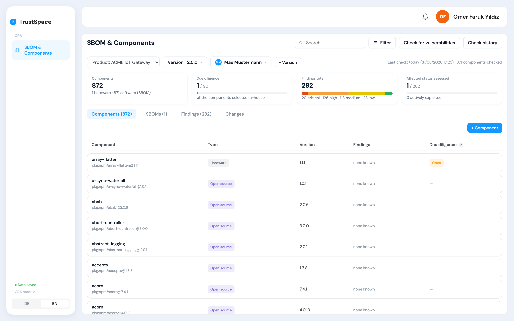
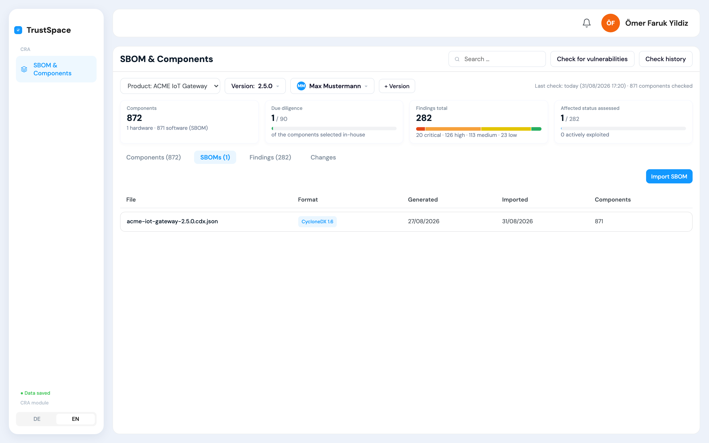
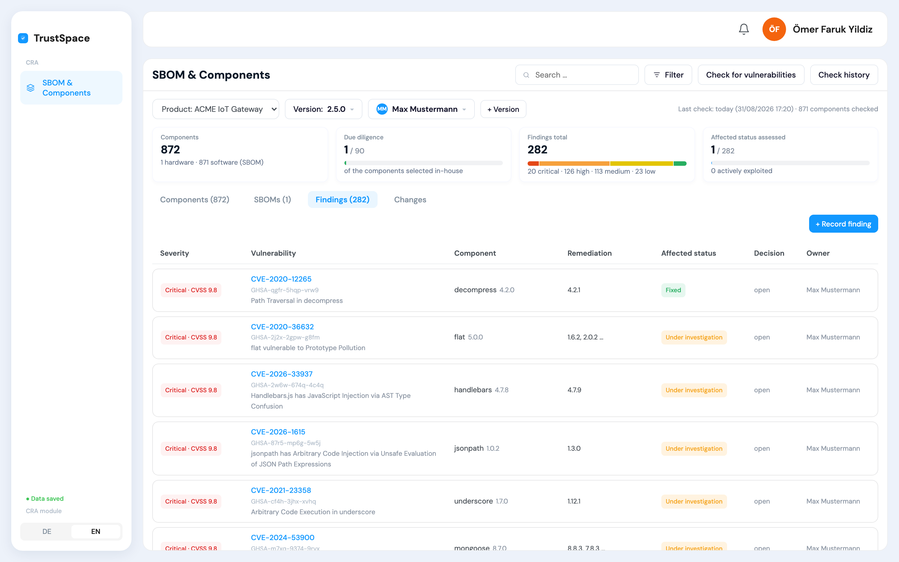
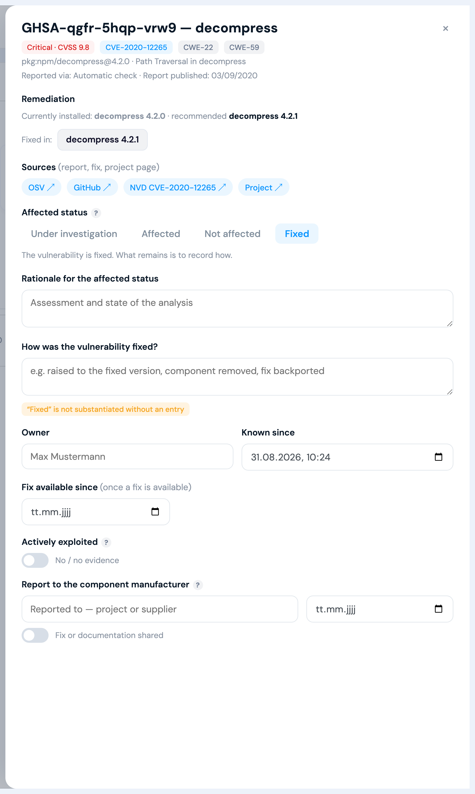
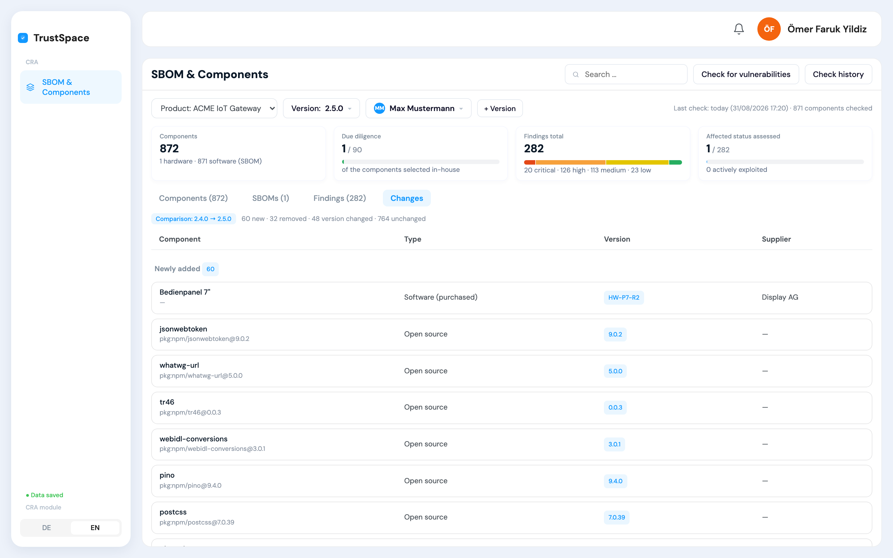

# SBOM-Gen — SBOM ingestion, component inventory and CVE matching

Working implementation of the **"SBOM & Components"** module for a CRA compliance product
(Regulation (EU) 2024/2847). It takes the SBOM a customer's build produces, maintains a component
inventory per product version, and matches that inventory against a live vulnerability database.

**There is no demo mode and no seeded data.** Every product, component and finding in the database
got there through an import, a manual entry, or a real HTTP call to OSV.dev. If the network is
down, the scan fails with an error instead of inventing results.

---

## What the module covers

One screen, four tabs. **Those four are the whole module.** The product and version pickers above
them — `+ Version` included — are in the app because every list needs a version to hang on;
managing products and versions belongs to a different module and is not described here.

| Tab | The question it answers | Requirement behind it |
|---|---|---|
| **Components** | What is inside this product version? | Annex I Part II No. 1 · Art. 13(5) |
| **SBOMs** | Which machine-readable list proves it, and when was it generated? | Annex I Part II No. 1 · Annex VII No. 8 |
| **Findings** | Which vulnerabilities sit in those components, and what was decided about each one? | Annex I Part II No. 1, 2 and 4 · Art. 13(6), 13(7) · Art. 14 |
| **Changes** | What moved between this version and the one before it? | supports Art. 13(5) |

---

### Components — the inventory



Every component of one product version in a single list. The inventory is a **superset of the
SBOM**: software arrives through the import, hardware and purchased components are entered by hand,
and an import never deletes a hand-added entry. Each row carries type, version, supplier, its
findings count and a due diligence status.

- **Built from** — React 19 for the table and the drawer, better-sqlite3 for the `components` and
  `component_edges` tables. No grid library, no state library. The dependency path of a
  transitive component (`GET /api/components/:id/path`) loads that version's edges in one query and
  then walks them backwards to the root breadth-first — shortest path, thirty lines of JavaScript,
  no graph library.
- **Covers** — *Annex I Part II No. 1*: identify and document the components contained in the
  product. Recording type and supplier per component is also what makes *Art. 13(5)* due diligence
  attachable to a specific entry instead of to the product as a whole.

---

### SBOMs — the machine-readable proof



Every imported file with its format, the date the generator stamped into it, the date it was
imported, and how many distinct components it contributed. The **original JSON is stored
byte-for-byte** and can be downloaded again (`GET /api/sboms/:id/download`) — the tool never hands
back a re-serialised version of someone else's document.

- **Built from** — a hand-written parser, about 40 lines in `src/pages/SbomTool.jsx`, reading
  **CycloneDX** (`components[]`, nested, plus `dependencies[]` over `bom-ref`) and **SPDX**
  (`packages[]`, plus `relationships[]` of type `DEPENDS_ON`, purl taken from `externalRefs`).
  No CycloneDX or SPDX library is involved — see [below](#what-is-deliberately-not-a-library).
- **Covers** — *Annex I Part II No. 1*: an SBOM in a commonly used, machine-readable format
  covering at least the top-level dependencies. *Annex VII No. 8*: the SBOM belongs to the technical
  documentation and may have to be handed to an authority on a reasoned request — which is why the
  original file is kept rather than a normalised copy. *Art. 13(24)*: the Commission may prescribe
  format and elements later, so the tool records the format and does not enforce one.

---

### Findings — vulnerabilities and their triage



One row per (vulnerability, component) pair, produced by matching the inventory against OSV.dev.
Opening a row gives the triage drawer: affected status, decision, owner, the point of awareness,
whether the vulnerability is actively exploited, and whether it was reported upstream.



- **Built from** — the [OSV.dev](https://osv.dev) API over two endpoints, called from the server
  only, via Node's built-in `fetch` — no HTTP client library. The CVSS 3.x base score is computed
  locally from the vector string. Details: [External data sources](#external-data-sources).
- **Covers**
  - *Annex I Part II No. 1* — identify and document the vulnerabilities contained in the product.
  - *Annex I Part II No. 2* — handle and remediate without delay. The decision, its rationale and
    the target version are what makes "without delay" provable after the fact.
  - *Annex I Part II No. 4* — once an update is available, publish information about the fixed
    vulnerability. The drawer produces a **draft** advisory; publishing stays the manufacturer's act.
  - *Art. 13(6)* — vulnerabilities in third-party components must be reported to their maintainer,
    open source included, and a fix that was produced must be shared. Two fields and a toggle.
  - *Art. 13(7)* — systematic documentation of security-relevant activity: every field change is
    written to `audit_log` with its old and new value.
  - *Art. 3(42)* and *Art. 14* — "actively exploited" is a manual flag that demands written
    evidence and is never inferred from a CVSS score; the point of awareness is captured as its own
    timestamp because it is what starts the reporting clocks.

---

### Changes — what moved between two versions



An automatic comparison against the previous version of the same product — nothing is maintained by
hand. It reports newly added, removed, version-changed and unchanged components.

- **Built from** — no library at all. Two SQL reads plus purl matching: identical purls cancel out
  first, and only the remainder is paired per package into "version changed". Matching on the
  package name alone would invent downgrades wherever an npm tree carries the same package twice.
- **Covers** — not a requirement of its own. It supports *Art. 13(5)*: due diligence has to be
  exercised when third-party components are integrated, and this is the list of what actually
  entered the product in this release.

---

## Quick start

```bash
npm install
npm start            # API on :5178 and UI on :5200 in parallel
```

Open <http://localhost:5200>. **The database ships with the repository**
(`server/sbom.db`), so the product, both versions, the imported SBOMs and the findings are there
immediately — nothing to set up first.

To start from scratch instead, delete `server/sbom.db` before the first start; the server creates
an empty one and you can walk through the flow below yourself.

### Walking the flow yourself (5 minutes, on an empty database)

1. **Create a product.** Click *Create a product*, e.g. `ACME IoT Gateway`, version `2.4.0`.
2. **Import the SBOM.** Either attach it right in the product dialog, or open the *SBOMs* tab and
   import [`sboms/acme-iot-gateway.cdx.json`](sboms/acme-iot-gateway.cdx.json) from this repository.
   → 951 components land in the inventory, the original file is archived. A version can hold
   several SBOMs — one per artifact, say backend and firmware — and they all feed one inventory.
3. **Run the scan.** Click *CVE-Abgleich (OSV)*. Takes about 15–20 seconds.
   → around 375 findings. Most arrive with a CVE number and a concrete fixed version, all of them
   with links to the advisory, the NVD entry and the project.
4. **Triage a finding.** Open any row in the *Findings* tab. The drawer shows the CVE number, the
   weakness class, which versions fix it and where the advisory lives — click a version to adopt it
   as the remediation target. **Everything saves as you go**: selections immediately, free text after
   a short pause. There is no save button and nothing to cancel. Re-run the scan: your triage
   survives, only advisory data is refreshed.
5. **Create a second version** with *+ Version*. The dialog asks the one question that matters:
   *has the software composition changed?*
   - **No** → components and the SBOM snapshot are carried over, and the new version is documented
     straight away.
   - **Yes** → only hardware carries over (it is not part of an SBOM) and you upload the new SBOM
     right there. Try it with `sboms/acme-iot-gateway-2.5.0.cdx.json`.

   Then open the *Changes* tab: added / removed / version-changed, computed live from the two
   inventories.
6. **Look at the scan history** (button in the header): every scan with its timestamp, how many
   components it checked and how many findings were new or refreshed.

Separate processes if you prefer: `npm run server` and `npm run dev`.

### Working through the findings

238 findings is a lot to work through, so filtering carries the weight.

**Filtering** lives behind the *Filter* button next to the tabs, grouped by dimension (type,
origin, severity, due diligence for components; severity, affectedness, remediation for findings).
Counts sit on every option and empty ones are greyed out, so you can see where the work is before
you click.

Assessing affectedness stays a per-finding decision. A VEX statement says something about *this*
product's exposure to *that* vulnerability, so there is deliberately no bulk action that sets it for
many findings at once — a blanket "not affected" with one shared justification documents nothing and
would not survive scrutiny.

### Where a transitive component comes from

Art. 3(39) defines an SBOM as a record of the details **and the supply-chain relationships** of the
components, and both formats carry them: CycloneDX in `dependencies`, SPDX in `relationships`. The
import stores them in `component_edges`, and `GET /api/components/:id/path` walks back from a
component to the product root.

That matters for the findings you cannot act on directly. `xmlhttprequest-ssl` carries two critical
vulnerabilities and appears nowhere in the project's `package.json` — there is nothing to upgrade.
The drawer shows why:

```
socket.io-client 2.3.0 → engine.io-client 3.4.4 → xmlhttprequest-ssl 1.5.5
```

The finding cannot be fixed on the broken package; the direct dependency to update is
`socket.io-client`.

The remediation block above it names the installed version and, out of the several fix versions an
advisory usually lists across maintenance branches, marks the one that actually applies: for
`qs 6.7.0` that is `6.7.3`, not `6.10.3`. The two blocks read as one instruction — *what you have,
what you need, and which dependency gets you there*. In the bundled example 38 transitive components carry findings and every one of them resolves to
a direct dependency — updating `socket.io` alone clears several at once.

### One responsible person, not 238 assignments

The owner sits next to the version selector and applies to the whole product. Every finding
inherits it — the list shows the inherited name in grey — and an individual finding can still be
assigned to someone else in its drawer. ENISA 4.13 asks for *an* owner for triage and tracking,
which is one person for a product, not a field to fill in on every row.

### Several SBOMs, one inventory

A product made of a backend, a firmware image and a mobile app has three builds and three SBOMs.
All of them can be imported into the same version: each file is archived separately, and the
components merge into one inventory — which is what the vulnerability matching needs, and it keeps
the same CVE in two artifacts from being assessed twice.

Every SBOM names its own subject in `metadata.component`, so the artifact label is taken from the
file rather than typed: components imported from `backend.cdx.json` are tagged `acme-backend`,
those from the firmware build `panel-firmware`. A library present in both carries both labels. The
*Artifact* block in the filter then gives you the per-artifact view without splitting the screen.
Hardware entered by hand has no SBOM to take a name from, so that field is free text there.

### Supplier records and support periods

For hardware and purchased software the drawer carries what the regulation asks an economic
operator to be able to produce: the supplier's **name and address**, and the date the component was
acquired. From that date the tool shows how long the record has to be kept — Art. 23(2) says ten
years after acquisition, so a component bought in March 2026 stays on file until March 2036.

Next to it sits the supplier's own **support period**. The interesting case is the conflict: the
product is supported until 2031-06, the panel firmware only until 2028-12. If that component carries
a core function, the drawer says so plainly — Art. 13(8) lists the support periods of integrated
third-party components with core functions as a factor when setting your own. The product's support
period lives in the product popover next to the version selector, with a warning below five years,
which is the statutory floor unless the product is expected to be in service for less.

None of this applies to open source: there is no economic operator to name and no committed support
period, so the block only appears for hardware and purchased software.

### Due diligence applies to what you choose

The due diligence record is scoped to the components a manufacturer actually selects: hardware,
purchased software, and **direct dependencies**. Directness is read from the SBOM's own dependency
graph on import (CycloneDX `dependencies`, SPDX `relationships`), so in the bundled example it is
88 components rather than 740. Nobody vets 650 transitive packages one at a time, and Art. 13(5)
does not ask them to — it is about the components you decide to integrate.

### What the interface does not do

Products are not created here beyond the very first one — in the full product they come from the
product module. There is no manual *add component* or *add finding* button either: components arrive
through the SBOM, findings through the scan. Both remain available over the API
(`POST /api/versions/:id/components`, `POST /api/versions/:id/findings`) for the cases that need
them. Versions are managed in the version dropdown itself: click it to switch, use the bin icon
next to a version to delete it (the last one cannot be deleted).

The interface also carries no legal citations. They live in this README and in the code comments,
where they belong for a developer — the screen stays a working surface.


### Requirements

Node.js 18 or newer (the server uses the built-in `fetch`) and outbound HTTPS to `api.osv.dev`.
No API key, no account, no local vulnerability database.

---

## The bundled SBOMs are real

Two snapshots of the same fictitious product, one release apart:

| File | Components | Findings | Story |
|---|---|---|---|
| `sboms/acme-iot-gateway.cdx.json` | 951 | 375 | the legacy state |
| `sboms/acme-iot-gateway-2.5.0.cdx.json` | 980 | 287 | after a maintenance round |

Between them: 63 packages upgraded, 21 dropped (including `vm2`, which alone carried 43 findings),
29 added (`undici`, `pino` and their dependencies). That is what the *Changes* tab shows, and the
drop from 59 to 16 critical findings is the point of the whole exercise.

Neither was hand-written. Both were generated with the official CycloneDX generator from a real,
installed dependency tree:

```bash
npx @cyclonedx/cyclonedx-npm --omit dev --output-format JSON --output-file acme-iot-gateway.cdx.json
```

The dependency lists that produced them are included next to each file
(`*.package.json`) — around 90 direct dependencies, pinned to versions from roughly 2020/21 for the
first snapshot and to patched versions for the second, the sort of stack a shipped device backend
actually runs. Everything in the file is genuine: real packages, real versions, real transitive
resolution, real purls. Only the product name on top is fictitious.

That is what makes it useful as a fixture: the vulnerabilities it surfaces are real CVEs in real
libraries, fetched live at scan time. Concentrations sit where you would expect them —
`vm2@3.9.5` (43), `axios@0.21.1` (24), `dompurify@2.0.11` (20), `tar@6.1.0` (18),
`node-forge@0.9.2` (15).

Regenerating it with a newer generator or a different dependency set is fine — nothing in the code
depends on this particular file.

---

## How the data is organised

Everything domain-related hangs off the **product version**, never the product.

```
products (id, name, hersteller)
   └── versions (id, product_id, version, copied_from)
         ├── components (inventory: hardware + software)
         ├── sboms      (imported snapshots, original JSON kept verbatim)
         ├── findings   (vulnerabilities + triage state)
         └── scans      (scan log)
audit_log (ts, action, detail)   ← every mutation
```

SQLite via `better-sqlite3`, file `server/sbom.db` — ships with the repository (D-022) so the
demo opens with data; only the WAL side files are gitignored. Delete the file for a clean start.

### `components` — the inventory is a superset of the SBOM

| Field | Notes |
|---|---|
| `kind` | `hardware` · `software_eigen` · `software_oss` · `software_zukauf` |
| `name`, `version`, `supplier` | base data |
| `purl` | Package URL — the key the OSV matching runs on |
| `cpe` | for hardware/firmware; stored for documentation, no automated lookup |
| `license` | stored, never analysed |
| `is_core_function` | flag used when justifying the support period |
| `dd_status`, `dd_note` | due diligence record for third-party components |
| `source` | `manuell` or `sbom_import` |

Hardware belongs in the inventory but never in an SBOM — an SBOM covers the *software elements*
of a product by definition. So the inventory is the superset and the SBOM is the software subset.
Hardware vulnerabilities arrive through supplier advisories and are entered by hand.

---

## Import: SBOM → database

`POST /api/versions/:versionId/sboms`

The browser reads the file and normalizes both supported formats onto one shape, so nothing
downstream cares which format it was:

| Field | CycloneDX (`components[]`) | SPDX (`packages[]`) |
|---|---|---|
| Name | `name` | `name` |
| Version | `version` | `versionInfo` |
| purl | `purl` | `externalRefs[]` where `referenceType === "purl"` |
| Supplier | `supplier.name` / `publisher` | `supplier` (leading `Organization: ` stripped) |
| License | `licenses[0].license.id` | `licenseConcluded` |

The server then performs **two writes**:

1. **Archive.** The untouched original JSON goes into `sboms.content`. A market surveillance
   authority can request the SBOM as part of the technical documentation, and what you hand over
   should be the build artifact, not a re-serialization of it. Retrieve it with
   `GET /api/sboms/:id/download`.
2. **Upsert the inventory.** Matched by purl, falling back to the name. Hits get version, supplier
   and license refreshed; misses are inserted as `software_oss` / `sbom_import`.

**Re-importing never overwrites `kind`, `is_core_function`, `dd_status` or `dd_note`.** Those are
human judgments — a component someone classified as purchased firmware with a completed supplier
baseline must not be reset by the next build.

The detected format is stored as a **label and never validated**, because the Commission may still
prescribe SBOM format and elements by implementing act. Accept what arrives, record what it was,
enforce nothing. Likewise `depth`: top-level dependencies are the legal minimum, so `top_level`
is the default and a shallow SBOM never produces a warning.

---

## Scan: database → OSV.dev → findings

`POST /api/versions/:versionId/scan`. Runs server-side; the browser never talks to OSV.

**Source:** [OSV.dev](https://github.com/google/osv.dev) — purl-native, no API key.
Record schema: [OSV Schema](https://github.com/ossf/osv-schema).

1. **Select candidates.** `purl != '' AND kind != 'hardware'`. No purl, no matching. An empty
   selection returns `400` and writes no scan record.
2. **Batch query.** `POST https://api.osv.dev/v1/querybatch`, chunked at `QUERY_CHUNK = 400`
   purls per request, 30 s timeout each. Returns vulnerability IDs per component — **all of them,
   with no per-component cap**.
3. **Fetch details.** `GET https://api.osv.dev/v1/vulns/{id}` over the distinct IDs,
   `DETAIL_PARALLEL = 10` at a time. A failed detail request is tolerated; the finding is then
   stored with severity `—`.
4. **Enrich.** Everything the advisory carries and a reviewer needs is extracted and stored, so
   it shows up on the finding automatically — no extra lookup:
   - `aliases` → the **CVE number**, shown as the primary identifier in the table (the GHSA id
     stays underneath, because nobody recognises `GHSA-9m93-w8w6-76hh` but everybody knows
     `CVE-2023-3696`)
   - `affected[].ranges[].events[].fixed` → the **fixed versions** for *this* package, matched by
     purl so other packages in the same advisory do not leak in. Where a range only carries
     `last_affected`, the finding says so instead of pretending a fix exists.
   - `references` plus derived links → **sources**: OSV, the GitHub advisory, the NVD entry for
     each CVE alias, and the project page. How those links are made, and why the fix commit is
     currently not among them: [Sources on a finding](#sources-on-a-finding--how-the-links-are-made)
   - `database_specific.cwe_ids` → weakness classes, and `published` → advisory date
5. **Score locally.** The CVSS 3.x base score is computed from the vector string
   ([FIRST.org formula](https://www.first.org/cvss/v3.1/specification-document)) — OSV ships the
   vector but not the score. The GitHub severity label wins when present, otherwise thresholds on
   the computed score decide (`≥9` critical, `≥7` high, `≥4` medium).
6. **Upsert findings**, keyed on `(vuln_id, component_id)`:
   - **known finding** → only the advisory-derived data changes: severity, score, summary,
     aliases, CWEs, fixed versions, sources, `updated_at`. VEX status,
     decision, owner, exploitation evidence and the upstream fields are left alone. That is what
     makes a daily rescan safe.
   - **new finding** → `became_known_at = now`. This timestamp is the deadline anchor for
     regulatory reporting and is never derived from anything else.
   - Findings OSV no longer returns are **not** deleted. A disappearing match is not evidence that
     the product is unaffected.
7. **Log it.** A row in `scans` plus an `audit_log` entry.

If OSV is unreachable the endpoint answers `502` and changes nothing. There is deliberately no
fallback to cached data: a scan that did not happen must not look like one that did.

Both constants live at the top of `server/index.mjs` and can be raised.

### Check it yourself

```bash
# what our API stored
curl -s -X POST http://localhost:5178/api/versions/<vid>/scan | jq '.scan'

# what OSV returns for one package, independently of this tool
curl -s -X POST https://api.osv.dev/v1/querybatch \
  -H 'Content-Type: application/json' \
  -d '{"queries":[{"package":{"purl":"pkg:npm/vm2@3.9.5"}}]}' | jq
```

The ID sets match. That comparison is the acceptance test for "the scanner is real".

---

## Triage

`PATCH /api/findings/:id` (whitelisted fields only)

The drawer follows the order the work actually happens in:

1. **Affectedness (VEX)** — `under_investigation` → `affected` / `not_affected` / `fixed`.
   First, because "not affected" with a justification closes a finding without remediation, which
   is how the false positives inherent to SBOM matching get cleared.
2. **Decision** — `fix_now` / `mitigate` / `accept` / `defer`. `accept` requires an expiry date;
   `accept` and `defer` require a rationale. The fixed versions from the advisory are offered as
   buttons: picking one writes it to `fix_version` and sets the decision to *fix now*, so the
   remediation target is recorded rather than retyped.
3. **Actively exploited** — a separate boolean with a mandatory evidence field. **Never derived
   from the CVSS score**: the legal definition requires reliable evidence of real-world
   exploitation, which a severity number is not. The module records the flag and its evidence,
   nothing more — deadlines live in the reporting module (D-036).
4. **Upstream report** — who the vulnerability in a third-party component was reported to, when,
   and whether fix code was shared.
5. **Advisory draft** — available once a finding is `fixed`; downloads a Markdown skeleton
   pre-filled with the affected product and version, the remediation target and the source links.
   Publishing stays with the manufacturer.

Findings that arrive outside the scanner — an email to the security contact, a supplier advisory,
a CSIRT notification, your own testing — are entered with `POST /api/versions/:id/findings`.
`vuln_id` and `became_known_at` are mandatory there; a finding without a time anchor is useless
as evidence.

---

## Versions and the automatic comparison

`POST /api/products/:id/versions` with `{ version, copyFrom }` copies the **components** of the
previous version and records `copied_from`. Findings and SBOMs are deliberately not copied —
each version carries its own assessment.

`GET /api/versions/:id/diff` computes the comparison; nothing is maintained by hand. The matching
key strips the version off the purl:

```js
const key = c => c.purl ? 'p:' + purlBase(c.purl)          // purl WITHOUT @version
                        : 'n:' + c.kind + '|' + c.name.toLowerCase()
```

Without that, upgrading `lodash@4.17.20` to `4.17.21` would read as "removed + added" instead of
**changed**. Output: `added` / `removed` / `changed` (with `from`/`to`) / `unchanged`.

---

## API

| Method | Path | Purpose |
|---|---|---|
| `GET` | `/api/bootstrap` | products and versions |
| `POST` | `/api/products` | product plus first version |
| `POST` | `/api/products/:id/versions` | new version; `mode: 'unchanged'` copies components **and** the SBOM snapshot, `mode: 'new_sbom'` copies hardware only |
| `DELETE` | `/api/products/:id` · `/api/versions/:id` | delete (cascades) |
| `GET` | `/api/versions/:id` | components, sboms, findings, scans |
| `GET` | `/api/versions/:id/diff` | comparison against the previous version |
| `POST` | `/api/versions/:id/components` | add a component (mainly hardware) |
| `PATCH` `DELETE` | `/api/components/:id` | update / delete |
| `GET` | `/api/components/:id/path` | dependency path from the product root to this component |
| `POST` | `/api/versions/:id/sboms` | import an SBOM |
| `PATCH` | `/api/sboms/:id` | depth |
| `GET` | `/api/sboms/:id/download` | original JSON |
| `POST` | `/api/versions/:id/scan` | OSV matching |
| `POST` | `/api/versions/:id/findings` | enter a finding manually |
| `PATCH` | `/api/findings/:id` | triage |
| `GET` | `/api/audit` | audit log, last 200 entries |

---

## Regulatory anchors

Every non-obvious rule in the code traces to a provision of Regulation (EU) 2024/2847:

| Behaviour | Provision |
|---|---|
| Identify and document components and vulnerabilities, SBOM in a machine-readable format covering at least the top-level dependencies | Annex I Part II No. 1 |
| An SBOM covers software elements — hardware stays in the inventory | Art. 3(39), Art. 3(6) |
| Due diligence for integrated third-party components, open source included | Art. 13(5) |
| Report vulnerabilities in third-party components upstream, share fix code | Art. 13(6) |
| Systematic documentation of security-relevant activity (the audit log) | Art. 13(7) |
| Support-period reasoning uses core-function components | Art. 13(8) |
| "Actively exploited" needs reliable evidence — never inferred from CVSS | Art. 3(42) |
| The point of awareness starts the 24 h / 72 h reporting clocks | Art. 14 |
| Handle and remediate vulnerabilities without delay | Annex I Part II No. 2 |
| Publish information about fixed vulnerabilities once an update is available | Annex I Part II No. 4 |
| SBOM belongs to the technical documentation on a reasoned request | Annex VII No. 8 |
| Where the SBOM is available is stated only if it is published to users | Annex II No. 9 |
| Format and elements of the SBOM may be prescribed later — so the format is not enforced | Art. 13(24) |

---

## Deliberately out of scope

- **Generating SBOMs.** The customer's build does that (Syft, Trivy, cdxgen, a build plugin).
  This tool consumes them.
- **The Article 14 reporting chain** with its calculated deadlines — a separate module. Marking a
  finding as actively exploited records the flag and its evidence; no deadline appears here (D-036).
- **Publishing advisories and shipping updates.** The tool produces a draft and keeps the record;
  acting is the manufacturer's job.
- **Supplier master data.** Components link to supplier management, they do not replace it.
- **License analysis.** The license field is carried along, never evaluated.
- **Internal SLA timers.** Deliberately absent: the statutory deadlines are what matter, and
  proof of acting "without delay" comes from documented triage, not from a traffic light.
- **NVD / CISA KEV integration.** Reasoning under
  [Deliberately not integrated](#deliberately-not-integrated).
- **Product and version management.** The pickers and `+ Version` are in the app because the lists
  need a version to hang on; the module itself is the four tabs.

---

## Open source in this module

Six direct dependencies, every one of them MIT. `package-lock.json` resolves to 183 packages in
total, almost all of them build-time. What ships to the browser is React and this repository's own
code — nothing else.

| Library | Version | Licence | What it does here |
|---|---|---|---|
| [express](https://github.com/expressjs/express) | 5.2.1 | MIT | the HTTP layer of `server/index.mjs`: all 20 routes and JSON body parsing (`express.json({ limit: '25mb' })` — SBOMs are large) |
| [better-sqlite3](https://github.com/WiseLibs/better-sqlite3) | 13.0.3 | MIT | synchronous SQLite access to the eight tables (`products`, `versions`, `components`, `component_edges`, `sboms`, `findings`, `scans`, `audit_log`). Synchronous is the point: an import writes hundreds of rows in one transaction without a callback in sight |
| [react](https://github.com/facebook/react) · [react-dom](https://github.com/facebook/react) | 19.2.8 | MIT | the entire interface — tables, tabs, drawers, filters. Component state only, no store |
| [vite](https://github.com/vitejs/vite) | 7.3.6 | MIT | dev server with hot reload, and the production build |
| [@vitejs/plugin-react](https://github.com/vitejs/vite-plugin-react) | 4.7.0 | MIT | the JSX transform |

No UI framework, no component library, no state library, no ORM, no HTTP client, no date library,
no icon package. Icons are inline SVG, dates go through `Intl`, and HTTP uses Node's built-in
`fetch` (which is why Node 18 is the floor).

Beyond the runtime, one more open source tool matters: the bundled fixtures were generated with
[`@cyclonedx/cyclonedx-npm`](https://github.com/CycloneDX/cyclonedx-node-npm), the official
CycloneDX generator — see [The bundled SBOMs are real](#the-bundled-sboms-are-real). It is not a
dependency of this project; it produced the files, and the files are checked in.

### What is deliberately not a library

Three things a reader might expect to be a dependency are written out instead. Each was a decision,
not an oversight.

| Function | Where | Why it is not a dependency |
|---|---|---|
| **SBOM parsing** (CycloneDX + SPDX) | `src/pages/SbomTool.jsx`, ~40 lines | The tool reads five things out of an SBOM: components, their purls, their versions, whether they are top-level, and the dependency edges. Both formats expose all five in plain JSON. A full CycloneDX or SPDX library models the whole specification — signatures, vulnerabilities, licence expressions, evidence — and would pull far more surface area into the browser bundle than the five fields justify |
| **CVSS 3.x base score** | `server/index.mjs`, `cvss3Score()` | OSV ships the CVSS *vector* but not the score. The [FIRST base-score formula](https://www.first.org/cvss/v3.1/specification-document) is fifteen lines of arithmetic with published constants. Computing it locally keeps the number reproducible from the vector that is stored next to it |
| **purl handling** | string comparison throughout | Package URLs are only ever compared, grouped and displayed here, never constructed or re-encoded. `===` and one `split` do the whole job |

---

## External data sources

**Exactly one service is called.** No telemetry, no analytics, no font CDN, no error reporter.
The browser talks only to this project's own API; outbound HTTPS happens on the server.

### OSV.dev — the vulnerability data

|  |  |
|---|---|
| Service | [OSV.dev](https://osv.dev), operated by Google with the OpenSSF — the server itself is open source ([google/osv.dev](https://github.com/google/osv.dev)) |
| Record schema | [OSV Schema](https://github.com/ossf/osv-schema) — the format the responses come in |
| Authentication | **none.** No API key, no account, no registration |
| Why this one | it is purl-native. The inventory already holds purls from the SBOM, so a query needs no name-to-CPE guessing step |
| Called from | `server/index.mjs` only — the browser never contacts OSV |

**The two endpoints**

| Endpoint | Method | What it is used for | How it is called |
|---|---|---|---|
| `https://api.osv.dev/v1/querybatch` | `POST` | one request per batch of purls, returns the vulnerability IDs per component — all of them, with no per-component cap | chunked at `QUERY_CHUNK = 400` purls per request, 30 s timeout each |
| `https://api.osv.dev/v1/vulns/{id}` | `GET` | the full advisory record for one vulnerability | over the distinct IDs, `DETAIL_PARALLEL = 10` at a time. A failed detail request is tolerated — the finding is stored with severity `—` rather than dropped |

Both constants sit at the top of `server/index.mjs`. If OSV is unreachable the endpoint answers
`502` and changes nothing: a scan that did not happen must not look like one that did.

**What is read out of a response**

| Field in the OSV record | What it becomes in the finding |
|---|---|
| `id` | the vulnerability identifier (`GHSA-…`, `PYSEC-…`) |
| `aliases` | the **CVE number**, shown as the primary identifier — nobody recognises `GHSA-9m93-w8w6-76hh`, everybody knows `CVE-2023-3696` |
| `affected[].ranges[].events[].fixed` | the **fixed versions for this package**, matched by purl so other packages in the same advisory do not leak in |
| `affected[].ranges[].events[].last_affected` | "no fix available, affected up to X" — instead of pretending a fix exists |
| `severity[].score` (`CVSS_V3`) | the CVSS vector; the base score is computed from it locally |
| `database_specific.severity` | the publisher's severity label, used only when no numeric score can be computed |
| `database_specific.cwe_ids` | the weakness classes shown as chips |
| `published` | the date the advisory was published |
| `references` | the source links |

**Covers** — *Annex I Part II No. 1*, the vulnerability half of it: identifying which vulnerabilities
are contained in the product's components. The scan is the mechanism; the finding is the record.
Every scan also writes a row to `scans` and one to `audit_log`, which is *Art. 13(7)*.

### Sources on a finding — how the links are made

Each finding carries a handful of source links. They are hyperlinks in the drawer and lines in the
advisory draft. **None of them is ever requested by the tool** — and no second service is queried to
obtain them. There is one OSV response, and everything comes out of it in two different ways.

**Constructed from an identifier.** Three of the four are plain string concatenation
(`sourcesOf()`, `server/index.mjs`):

```js
add('OSV', 'https://osv.dev/vulnerability/' + rec.id)
if (rec.id.startsWith('GHSA-')) add('GitHub', 'https://github.com/advisories/' + rec.id)
for (const a of rec.aliases || []) {
  if (a.startsWith('CVE-')) add('NVD ' + a, 'https://nvd.nist.gov/vuln/detail/' + a)
  if (a.startsWith('GHSA-')) add('GitHub', 'https://github.com/advisories/' + a)
}
```

Three parts to that:

- **The prefix** is each service's permalink scheme — `osv.dev/vulnerability/<id>`,
  `github.com/advisories/<GHSA>`, `nvd.nist.gov/vuln/detail/<CVE>`. Nothing derived, just the
  address under which these three publish their entries.
- **The identifier** is passed through from the OSV record untouched: `id`, or an entry of
  `aliases`. Never shortened, normalised or rewritten.
- **The `startsWith` guards** are the actual mechanism. They are not validation — they decide
  *which service can know this identifier at all.* A `PYSEC-…` id gets no GitHub link, because
  GitHub does not carry it.

That is also why the GitHub link is not a guess: for npm, OSV's upstream **is** the GitHub Advisory
Database, so the OSV id *is* the GHSA id. In the bundled database all 652 findings carry a `GHSA-…`
identifier — hence 652 OSV links, 667 GitHub links and 639 NVD links, without a single lookup.

A `Set` over the URL inside `add()` deduplicates, which matters because OSV usually lists the NVD
page in `references[]` as well — the constructed link and the listed one are the same address.

**Taken from the record.** Everything else comes out of `references[]` — the links the advisory
itself carries. They are relabelled (`PACKAGE` → project page, `REPORT` → report, `ADVISORY` →
report) and capped at twelve sources per finding.

**Nothing verifies that a constructed address resolves.** No HEAD request, no fallback. In practice
it holds — 24 stored links checked live, six per kind, all `200`. But the failure modes differ, and
only one of them is honest:

| Service | Response to an identifier it does not have |
|---|---|
| GitHub | `404` — visible immediately |
| OSV | `200` with an empty page — the failure only shows in the browser |
| NVD | `200`, redirected to the **NVD home page** — looks like a hit, is not one |

That is tolerable while identifiers arrive from OSV untouched. It would stop being tolerable the
moment someone can type an identifier by hand.

Links are built once during the scan and stored in `refs_json`, not regenerated on display. A
rescan overwrites them, so a changed permalink scheme would propagate to old findings on the next
scan.

**Known gap: fix commits do not make it through.** The filter accepts four of the eleven reference
types in the OSV schema — `ADVISORY`, `FIX`, `REPORT`, `PACKAGE` — and drops the rest, `WEB`
included. GitHub advisories type nearly everything as `WEB`. Measured over 40 records fetched live
from OSV: 199 of 273 references are `WEB` and are discarded, 30 of the 40 advisories carry a commit
or pull-request link, and **not one uses the type `FIX`**. Across all 652 stored findings the label
"fix" therefore never appears once. The link to the commit that closes the vulnerability — the most
concrete thing an advisory has, and the one *Annex I Part II No. 4* is most interested in — is
currently lost. Fixing it means judging references by URL shape rather than by type.

**Covers** — *Annex I Part II No. 4*: the published information has to let users recognise the
affected product, the impact and the severity. The draft advisory carries these sources so the
reader can verify the claim rather than take it on trust.

### Deliberately not integrated

**NVD and the CISA KEV catalogue.** OSV covers the same ground for package dependencies and is
purl-native. A KEV badge would invite the false inference "no badge means not exploited", and the
catalogue is far from complete. *Art. 3(42)* defines an actively exploited vulnerability as one for
which reliable evidence exists — that stays a human decision with written evidence, not a lookup.

---

## Stack

Vite + React 19 on the front end, Express 5 + better-sqlite3 on the back end. One screen, no router.
The styling mirrors the target product's design tokens. Full dependency reasoning:
[Open source in this module](#open-source-in-this-module).
