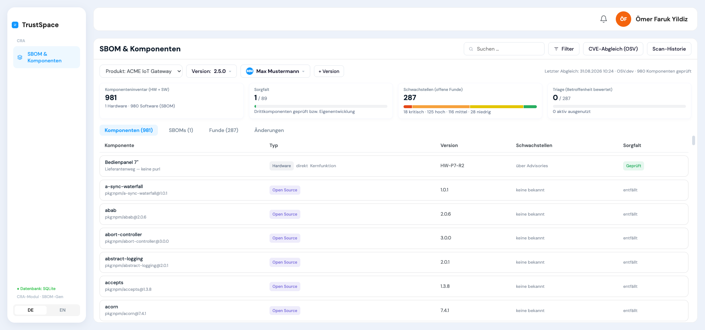
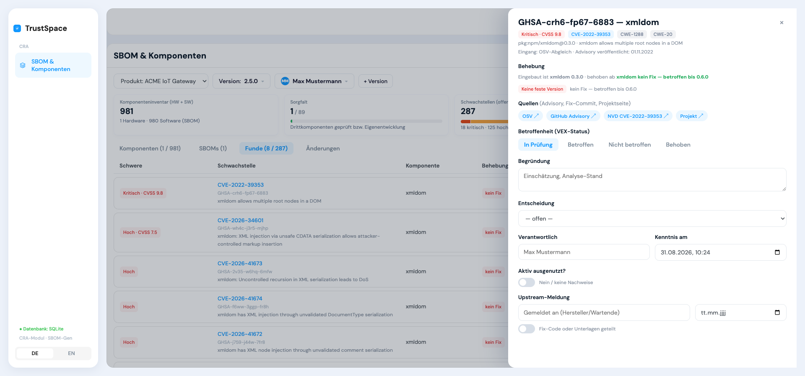
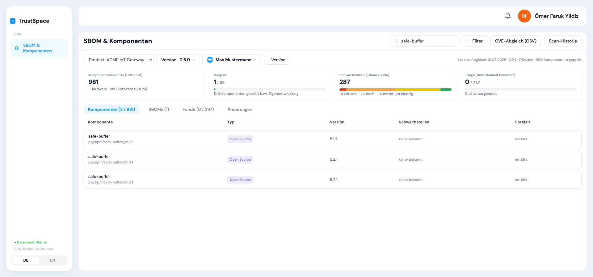
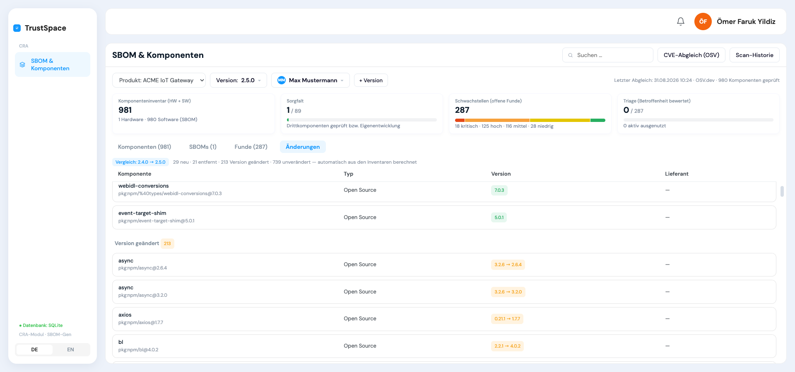
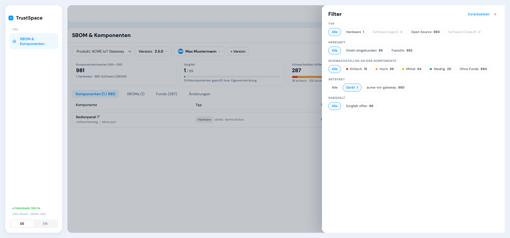

# Prüfbericht — Modul SBOM & Komponenten

**Datum** 31. August 2026
**Geprüfter Stand** `e0bf3ec` „Artefakt-Herkunft je Komponente", Zweig `main`
Nicht eingecheckt und nicht Gegenstand der Prüfung: zwei Zeilen für den Netzzugriff
(`vite.config.js` mit `host: true`, `app.listen` auf `127.0.0.1`) — sie berühren keine
der geprüften Logiken.
**Anwendung** Oberfläche `localhost:5200`, Schnittstelle `localhost:5178` — beide erreichbar
**Dauer** rund zwei Stunden, sieben Prüfblicke parallel

**Datenbestand zum Zeitpunkt der Prüfung**

| | |
|---|---|
| Produkt | ACME IoT Gateway (ACME Industrial GmbH), verantwortlich Max Mustermann, Unterstützung bis 06/2031 |
| Versionen | 2.4.0 und 2.5.0 |
| Komponenten | 1 933 Zeilen (952 + 981), davon 2 Hardware |
| Abhängigkeitskanten | 2 732 |
| Funde | 662 (375 + 287) |
| davon bewertet | **0** |
| davon mit Zielversion | **0** |
| Protokolleinträge | 12 |

Die letzten beiden Nullen sind kein Zufall und kein Demo-Zustand — sie sind Befunde. Siehe M1.

**Wie geprüft wurde.** Sieben Blicke auf dieselbe Software: Vollständigkeit gegen den
Pflichtenkatalog, Daten und Rechnen gegen die Rohdateien, Abgrenzung gegen das
Entscheidungsprotokoll, Gestaltung gegen den Styleguide, Lesbarkeit Zeichenkette für
Zeichenkette, Übersetzung in beiden Sprachen, Bedienung im Browser. Jeder Befund trägt
eine Fundstelle: Zeilennummer, API-Antwort, Rohdatenvergleich oder Verordnungstext.

**Was die Einstufung bedeutet.** **MUSS** heißt: ohne das erfüllt der Hersteller eine
Pflicht der Verordnung nicht — jeder dieser Befunde wurde nach der Zusammenführung ein
zweites Mal gegen den Verordnungstext gehalten (siehe „Was die Nachprüfung zurückgestuft
hat"). **SOLLTE** heißt: die Pflicht ist erfüllbar, aber der Nachweis ist schwach oder
die Arbeit unzumutbar mühsam. **KANN** ist Komfort und Optik.

Zusätzlich trägt eine Handvoll Befunde die Marke **[D]** — Defekt. Das ist keine vierte
Klasse, sondern ein Hinweis quer zu den dreien: hier stürzt etwas ab oder die Software
gibt eine nachweislich falsche Zahl aus. Defekte gehören unabhängig von ihrer
Rechtsklasse zuerst behoben, weil sie billig sind und weil eine falsche Zahl schlimmer
ist als eine fehlende.

---

## 1 — Was funktioniert

Ein Bericht, der nur Mängel listet, ist nicht prüfbar. Das Folgende wurde nachgemessen,
nicht angenommen.

**Der Scanner ist echt.** 951 Komponenten in einem Lauf gegen OSV.dev abgeglichen, 375
Funde. Der frühere Deckel von acht Funden je Komponente greift nicht mehr — vm2 3.9.5
trägt 43 Funde, axios 24, dompurify 20. Ohne Netz gibt es kein Ersatzergebnis: der Server
antwortet mit 502 und schreibt nichts.

**Die CVSS-Rechnung stimmt exakt.** Alle 2 592 möglichen CVSS-3.1-Basisvektoren
durchgerechnet, **null Abweichungen** von der offiziellen Formel — einschließlich
Aufrundung und Sonderfall „Scope Changed".

**Die Stückliste wird vollständig eingelesen.** 2.4.0: 732 Einträge auf oberster Ebene
plus 219 geschachtelte = 951, alle in der Datenbank. 2.5.0: 740 + 240 = 980. Das
rekursive Auflösen verliert keinen Eintrag; `component_count` deckt sich exakt mit der
Datei.

**Die Abhängigkeitswege sind belegbar.** Acht Komponenten stichprobenweise geprüft, von
Tiefe 2 bis Tiefe 10. Jeder von der Schnittstelle gelieferte Weg ist Kante für Kante im
`dependencies`-Block der Datei nachweisbar. Zwei Einbauten desselben Pakets werden korrekt
getrennt geführt (`cookie 0.4.0` über express, `cookie 0.4.2` über socket.io).

**Die Empfehlung der Behebungsversion rechnet richtig.** 507 Fund-Komponenten-Paare
durchgerechnet, davon 106 mit mehreren Kandidaten. In allen Fällen ist die Empfehlung die
kleinste Version, die größer als die eingebaute ist und im selben Hauptzweig liegt —
mongoose 5.9.7 → 5.13.20, tar 6.1.0 → 6.1.1, koa 2.13.0 → 2.15.4, axios 0.21.1 → 0.32.0.

**Die Originaldatei kommt unverändert zurück.** Der Download liefert 1 203 597 Bytes mit
SHA-256 `c3c997a4…68d6f5` — Byte für Byte identisch mit der importierten Datei. Damit ist
Anhang VII Nr. 8 erfüllt.

**Ein erneuter Abgleich zerstört keine Bewertung.** Nachgeprüft: `vex_status`,
`vex_justification`, `decision`, `decision_rationale`, `accept_until`, `owner`,
`became_known_at`, `actively_exploited`, `exploit_evidence` und die drei Upstream-Felder
werden vom Update nicht angefasst. Überschrieben werden nur die Fremddaten aus OSV.

**„Aktiv ausgenutzt" wird nie aus CVSS abgeleitet.** Gezielt auf Scheinerfüllung geprüft:
Die Spalte kommt im Scan-INSERT nicht vor, `sevOf()` fasst sie nicht an. Gegenprobe: 78
Funde mit Schweregrad KRITISCH, `actively_exploited` bei 0 von 662 gesetzt. Art. 3 Nr. 42
ist damit sauber umgesetzt.

**Die Zehnjahresfrist wird gerechnet, nicht getippt.** Bezugsdatum + 10 Jahre,
schreibgeschützt angezeigt. Geprüft: 15.03.2026 → 15.03.2036.

**Die Abgrenzung nach außen stimmt — 8 von 8.** Keine der acht ausdrücklich
ausgeschlossenen Funktionen steckt in der Software: kein Update-Bau, keine
Advisory-Veröffentlichung, kein Meldeversand, keine Lieferantenpflege, keine
Lizenzanalyse, keine internen SLA-Uhren (`grep -i "sla|breach"` → 0 Treffer), keine
Massen-Bewertung, kein Dokumentgenerator. Keine Frist ist ein Eingabefeld. Jeder
Prozentbalken trägt seine Bezugsgröße daneben.

**Der Advisory-Entwurf ist mustergültig.** Kopfzeile „(ENTWURF)", Sperrvermerk
„Veröffentlichung erst nach Bereitstellung der Sicherheitsaktualisierung", Prüfvermerk in
der Fußzeile, und der Knopf heißt „Advisory-**Entwurf**", nicht „veröffentlichen". Er wird
erst freigeschaltet, wenn der Fund als behoben bewertet ist.

**Die Shell hält die Style-Parität wertgenau ein.** Sidebar 214 px, Navbar 64 px, Padding
und Abstand je 20 px, Drawer 688 px mit Radius `16px 0 0 16px`, Primärbutton-Verlauf
`#087ef5 → #11d3ef`, Fokusring `#1298ff` + `#a6d5fa`, Overlays und Modalschatten
wortgleich. Keine Emojis, nirgends. Der Primärbutton ist auf jeder Fläche genau einmal
vergeben — alle zehn Flächen einzeln durchgezählt.

### Der Durchlauf im Browser

Ein Prüfblick ist die Anwendung 236 Schritte lang durchgegangen — jeder Knopf, jeder
Reiter, jeder Drawer, jeder Filter, dazu leere Zustände, Fehlerfälle, schmales Fenster
und Sonderzeichen. Was dabei aufging:

**Die Zahlen stimmen quer durch die Oberfläche.** Kacheln, Reiterzähler, Filterzähler und
Tabellen wurden gegeneinander ausgezählt: 18 kritisch + 125 hoch + 116 mittel + 28 niedrig
= 287 Funde ✓. Sorgfalt 1 geprüft / 88 offen / 892 entfällt → Kachel `1 / 89` ✓. Filter
„Fix verfügbar 269" + „Kein Fix 18" = 287 ✓. Beim Umschalten auf 2.4.0: 60 + 147 + 135 +
33 = 375 ✓. Der Reiter behält beim Versionswechsel seine Auswahl.

**Der Filter ist sauber gebaut.** Er passt sich dem Reiter an — bei Komponenten fünf
Blöcke, bei Funden drei andere —, zeigt je Chip die Trefferzahl, der Reiter wird zu
„Komponenten (1 / 981)", und der Knopf trägt danach die Zahl der gesetzten Filter.

**Das automatische Speichern funktioniert und ist sofort sichtbar.** Betroffenheit auf
„Betroffen" gesetzt: die Kachel sprang live von `Triage 0 / 287` auf `1 / 287`, die
Tabellenzeile zog mit. Zurückgesetzt → wieder 0.

**Die Belastung trägt.** 981 Zeilen werden alle gerendert — 11 145 DOM-Knoten, Tabelle
64 497 px hoch — und das Scrollen bleibt flüssig. Reiterwechsel 288–357 ms, Tippen in der
Suche im schlechtesten Fall 226 ms. Bei 900 px Fensterbreite scrollt die **Seite nicht
waagerecht**; die Tabelle scrollt in ihrem eigenen Container, Kacheln und Kopfzeile
brechen sauber um, der Drawer passt sich an. Umlaute und Sonderzeichen werden überall
richtig dargestellt.

**Der Sprachwechsel mitten in der Arbeit verliert nichts.** Der Drawer bleibt offen, der
Kontext bleibt, die Reiter werden korrekt zu „Components / SBOMs / Findings / Changes".

**Der stärkste Screen der Anwendung** ist der Fund-Drawer mit Abhängigkeitsweg:
„Eingebaut ist underscore 1.7.0 · behoben ab underscore 1.12.1", darunter der Weg
`ACME IoT Gateway → jsonpath 1.0.2 → underscore 1.7.0` mit Legende und dem Klartextsatz,
was zu tun ist. Vier Quellenlinks. Das ist die Stelle, an der das Modul seinen Zweck
erfüllt.

**Der Hardware-Drawer ebenso:** kein purl-Feld (richtig), Anschrift, „Bezogen am
15.03.2026" mit dem gerechneten „Angaben vorzuhalten bis 15.03.2036", „Unterstützt bis
Dezember 2028" mit rotem „endet vor dem Produkt" und Erklärsatz.

Der Prüfblick hat sein Testprodukt anschließend restlos entfernt und den Bestand
gegengeprüft — die Datenbank ist unverändert.

**Und er hat zwei Befunde live bestätigt, die aus dem Code kamen:** der Klick auf
„Behoben in: decompress 4.2.1" erzeugt in der Konsole `Uncaught ReferenceError: setF is
not defined` und auf dem Bildschirm nichts (M1). Und bei `GHSA-crh6-fp67-6883` steht in
grüner Schrift „behoben ab **xmldom kein Fix — betroffen bis 0.6.0**", zwei Zeilen über
der roten Pille „Keine feste Version" (M4).

---

## 2 — Prioliste

Sortiert nach Klasse, innerhalb der Klasse nach Aufwand aufsteigend. Damit steht oben,
was pflichtig und billig ist.

### MUSS — neun Befunde

| | Befund | Wo | Fundstelle | Aufwand |
|---|---|---|---|---|
| **M1** [D] | Zielversion setzen wirft `ReferenceError` | `SbomTool.jsx:498` | Anhang I Teil II Nr. 2 | 1 Zeile |
| **M2** | Hardware und Zukauf über die Oberfläche nicht anlegbar | `SbomTool.jsx:1001`, `:1299` | Anhang I Teil II Nr. 1 · Art. 3 Nr. 1, 6 · Art. 23 · Art. 13 Abs. 8 | klein |
| **M3** | Kein Feld für die Verfügbarkeit der Korrekturmaßnahme | Tabelle `findings` | Art. 14 Abs. 2 Buchst. c | klein |
| **M4** [D] | „kein Fix" wird als grüne Zielversion empfohlen | `index.mjs:472`, `SbomTool.jsx:483` | Anhang I Teil II Nr. 2 | klein |
| **M5** | Quelloffene Kernkomponenten ohne Unterstützungsende | `SbomTool.jsx:355` gegen `:391` | Art. 13 Abs. 8 i. V. m. Abs. 5 | klein |
| **M6** [D] | SPDX-Import setzt `is_direct` nie — Sorgfalt entfällt für alle OSS-Pakete | `SbomTool.jsx:120` | Anhang I Teil II Nr. 1 · Art. 13 Abs. 5 | klein |
| **M7** | Funde außerhalb des Scanners nicht erfassbar | Oberfläche fehlt zu `POST /findings` | Anhang I Teil II Nr. 1 · Art. 14 | mittel |
| **M8** [D] | 108 bzw. 109 Dubletten im Komponenteninventar | `index.mjs:296` gegen `:311` | Anhang I Teil II Nr. 1 · Art. 13 Abs. 5 | mittel |
| **M9** | Erneuter Import räumt nicht auf und überschreibt Gepflegtes | `index.mjs:296–322` | Art. 13 Abs. 5 | mittel |

---

**M1 · Die Zielversion lässt sich nicht setzen — jeder Klick wirft** [D]

`SbomTool.jsx:498` ruft `setF(...)` auf. `FindingDrawer` destrukturiert aber
`const [f, set, saved] = useAutoSave(…)` (`:422`); die einzige `setF` ist der interne
Zustandssetzer von `useAutoSave` (`:135`) — eine andere Closure. Jeder Klick auf eine
Schaltfläche unter „Behoben in:" wirft `ReferenceError: setF is not defined` und
speichert nichts. Selbst wenn der Name aufgelöst würde, schriebe der Aufruf nur lokalen
Zustand ohne PATCH.

Der Beweis steht in den Daten: **0 von 662 Funden** tragen eine Zielversion, obwohl 507
von ihnen eine hätten. In der Folge ist auch alles unerreichbar, was daran hängt — das
grüne Pill (`:502`), die Spalte „Behebung" (`:1272`) und der Zweig im Advisory-Entwurf
(`:443`). Die sorgfältig geprüfte Rechnung `empfohleneFixVersion()` bleibt folgenlos.

Der Fehler entstand beim Umbau auf automatisches Speichern. Er erklärt nebenbei, warum
die CSS-Klasse `.hb.active` (`:494`) nie definiert wurde: der Zustand tritt nie ein.

**M2 · Hardware kommt nur per `curl` ins Inventar**

Der `ComponentDrawer` kann anlegen — `comp === null` ergibt Titel „Komponente
hinzufügen" (`:323`) und Knopf „Anlegen" (`:411`) — und `POST /api/versions/:id/components`
existiert. Aber `setCompOpen` wird nur mit einer Tabellenzeile aufgerufen (`:1196`); der
Zweig `compOpen === 'neu'` (`:1299`) ist toter Code. Die beiden Hardware-Datensätze der
ausgelieferten Datenbank wurden geskriptet erzeugt — das Protokoll zeigt
`component.create · Bedienpanel 7"` 13 ms nach dem SBOM-Import.

Der Leerzustand fordert genau das Gegenteil: „Noch keine Komponenten — SBOM importieren
oder Hardware/Software **manuell anlegen**" (`:1222`), und die README verspricht
„Hardware vulnerabilities … are entered by hand".

Die Folgen reichen weiter als der fehlende Knopf. Anschrift des Lieferanten, Bezugsdatum
und Unterstützungsende der Komponente stehen hinter `{!isOwn && f.kind !== 'software_oss' && …}`
(`:355`) — sie erscheinen nur bei Hardware und Zukauf. Da beides nicht anlegbar ist, sind
**Art. 23 Abs. 1/2 und Art. 13 Abs. 8 über die Oberfläche nicht erfüllbar**, obwohl die
Felder vorbildlich gebaut sind. Erreichbar werden sie nur, indem man eine importierte
OSS-Komponente auf „Hardware" umtypt.

Und der Ausweg über die Schnittstelle trägt nur halb: `POST /api/versions/:id/components`
nimmt `supplier_address`, `acquired_at` und `supplier_support_until` **nicht entgegen** —
die drei Spalten fehlen im INSERT (`index.mjs:252–257`) und werden still verworfen.
Selbst per `curl` entsteht die Komponente ohne die Angaben nach Art. 23; sie müssten in
einem zweiten Schritt nachgepatcht werden. Nebenbei setzt der Server `is_direct` für jede
manuell angelegte Komponente fest auf 1.

**M3 · Der zweite Fristanker aus Art. 14 fehlt vollständig**

Die Fundtabelle kennt an Datumsfeldern nur `became_known_at`, `accept_until`,
`upstream_reported_at`, `published`, `created_at`, `updated_at`. Ein Anker für
„Korrektur- oder Risikominderungsmaßnahme steht zur Verfügung" existiert nicht. Die drei
Kandidaten tragen ihn nicht: `fix_version` ist eine Versionszeichenkette ohne Datum,
`published` ist das Erscheinungsdatum des fremden Advisories, `accept_until` ist die
Befristung einer Risikoakzeptanz.

Der Abschlussbericht nach Art. 14 Abs. 2 Buchst. c ist spätestens 14 Tage **nach
Verfügbarkeit der Korrekturmaßnahme** fällig, ausdrücklich nicht ab Kenntnis. Ohne diesen
Anker kann das Modul Meldungen die zweite Fristenkette nicht starten — sie müsste
entweder doppelt erfasst oder vom Kenntniszeitpunkt aus gerechnet werden, was systematisch
das falsche Fälligkeitsdatum ergibt. Die eigene Referenz hält das fest und fordert
„zwei getrennte Zeitstempel im Datenmodell"; vorhanden ist einer.

**M4 · Fehlt ein Fix, empfiehlt die Software Fließtext als Version** [D]

Gibt es keine behebende Version, schreibt der Server den Satz
`kein Fix — betroffen bis 0.6.0` in das Feld `fixed_versions` (`index.mjs:472`).
`empfohleneFixVersion` zerlegt ihn: `parseInt('kein Fix — betroffen bis 0')` ergibt `NaN`
→ 0, daraus `[0,6,0]`, das ist größer als das eingebaute `[0,3,0]` — und die ganze
Zeichenkette wird als Zielversion zurückgegeben. Zeile 483 prüft nicht dagegen und
rendert **in Grün**:

> Eingebaut ist xmldom 0.3.0 · behoben ab **xmldom kein Fix — betroffen bis 0.6.0**

direkt über dem roten Pill „Keine feste Version". Der Abhängigkeitsweg baut daraus
zusätzlich: „Nötig ist eine Fassung von jsdom, die xmldom kein Fix — betroffen bis 0.6.0
oder neuer mitbringt."

Nachgezählt in der laufenden Datenbank: **33 Fundzeilen** tragen den Satz in einem
Versionsfeld, bei **16 davon** gewinnt er zusätzlich den Größenvergleich und wird als
grüne Zielversion empfohlen (xmldom 0.3.0 gegen „betroffen bis 0.6.0", siebenmal je
Version).

Ausgerechnet die Funde ohne Sicherheitsaktualisierung — die, für die eine Abhilfe
erarbeitet oder die Komponente ersetzt werden muss — werden als erledigbar dargestellt.

Ursache ist ein Datenmodellfehler: deutscher Fließtext in einem Feld, das Versionen
tragen soll. Derselbe Text ist zugleich Programmzustand — der Filter „Fix verfügbar /
Kein Fix" hängt an `startsWith('kein Fix')`. Sauber wäre `fix_status` als Code plus
`last_affected` als Versionsliste.

**M5 · Eine quelloffene Kernkomponente kann kein Unterstützungsende bekommen**

Der Schalter „Kernfunktion des Produkts?" (`:391`) steht **außerhalb** der Bedingung auf
`:355`, das Datumsfeld „Unterstützt bis" (`:374`) innerhalb. Ein OSS-Paket kann damit als
Kernfunktion markiert werden, ohne dass je ein Unterstützungsende hinterlegt oder ein
Konflikt zum Produkt angezeigt werden kann.

Art. 13 Abs. 8 verlangt, die Unterstützungszeiträume integrierter Drittkomponenten mit
Kernfunktion bei der Festlegung des eigenen Zeitraums zu berücksichtigen; Art. 13 Abs. 5
stellt klar, dass Drittkomponenten quelloffene Software einschließen. Der praktisch
häufigste Fall — eine OSS-Kernbibliothek, deren Wartungszweig vor dem Produktende
ausläuft — ist im Modul nicht abbildbar. In der laufenden Datenbank sind 980 von 981
Komponenten `software_oss`.

**M6 · Bei einem SPDX-Import verschwindet die Sorgfaltspflicht für alle OSS-Pakete** [D]

`is_direct: directRefs.has(c['bom-ref']) ? 1 : 0` (`:120`) — `directRefs` und `rootRef`
stammen ausschließlich aus `jx.dependencies` und `jx.metadata.component`, beides
CycloneDX-spezifisch. Bei einer SPDX-Datei sind sie `undefined`, also bekommt **jede**
Komponente `is_direct = 0`. Die SPDX-Auswertung existiert (`:97`, `:107`), speist aber nur
die Abhängigkeitskanten, nicht die Direktheit.

Die Sorgfaltspflicht hängt vollständig daran:
`ddRelevant = kind==='hardware' || kind==='software_zukauf' || !!is_direct` (`:1056`).
Bei SPDX schrumpft der Nenner auf Hardware und Zukauf, die Spalte „Sorgfalt" zeigt für
jedes OSS-Paket „entfällt", und die Kennzahl sieht dabei **gut aus**. Art. 13 Abs. 5 nennt
quelloffene Software ausdrücklich; das Modul meldet dem Hersteller wortlos, dafür sei
keine Sorgfalt zu führen.

Zweite Folge: der Filter „Direkt eingebunden" steht auf 0, und die dokumentierte Tiefe
wird ohnehin pauschal auf `top_level` gesetzt (`:126`) statt aus dem Baum abgeleitet.

**M7 · Ein Fund, den der Scanner nicht findet, kann nicht erfasst werden**

Alle **662 Funde** tragen `intake_channel = 'osv_scan'`, ohne eine Ausnahme. Die sechs
gepflegten Eingangskanäle (`INTAKE`, `:38–45` — Meldung per Mail, Lieferanten-Advisory,
eigener Test, Hinweis von außen …) werden ausschließlich lesend angezeigt. Der Abschnitt
`// --- Fund erfassen ---` steht in der Sprachdatei als leere Rubrik, der Kommentar
„Manuelle Fund-Erfassung (D-020)" in `SbomTool.jsx:623` ohne folgende Komponente.

Der Server ist fertig und prüft sogar das Richtige:
`'Kenntniszeitpunkt fehlt (startet die Fristen, Art. 14)'` (`index.mjs:494`). Diese Prüfung
kann nie ausgelöst werden, weil der Endpunkt keine Oberfläche hat.

Damit fehlen genau die Funde, die in der Praxis die Fristen auslösen: Meldungen über die
Sicherheitsadresse, Lieferanten-Advisories zur Hardware, eigene Testergebnisse. Zusätzlich
schließt der Abgleich Hardware und purl-lose Komponenten aus (`index.mjs:427`) — für die
gibt es damit **gar keinen** Weg in die Funde. Das Modul dokumentiert nur den
automatisierbaren Teil der Pflicht und wirkt vollständiger, als es ist.

**M8 · 108 bzw. 109 Komponenten stehen doppelt in der Datenbank** [D]

`const existing = …` wird **einmal vor** der Einfügeschleife gelesen und nie um die frisch
eingefügten Zeilen ergänzt (`index.mjs:296` gegen `:311`). Kommt dieselbe purl in der
Datei mehrfach vor — bei geschachtelten CycloneDX-Bäumen der Normalfall —, wird sie
mehrfach eingefügt. Es gibt keinen eindeutigen Index auf `(version_id, purl)`.

Nachgerechnet: 951 aufgelöste Einträge, aber nur **843 distinkte purls** → 108 Dubletten
(`pkg:npm/debug@4.4.3`, `pkg:npm/qs@6.7.0`, `pkg:npm/safe-buffer@5.2.1` …). In 2.5.0:
980 Zeilen, 871 distinkte purls, 109 Dubletten. Die Zeilen sind in Name, Version, purl,
Lizenz, Lieferant und Artefakt identisch — in der Oberfläche nicht unterscheidbar.

Die Kachel zeigt „952 Komponenten · 951 Software", real sind es 844. Der Abgleich fragt
951 statt 843 purls ab. Und der Hersteller pflegt Sorgfaltsnachweis, Kernfunktion und
Lieferantenangaben an einer von zwei identischen Zeilen — die zweite bleibt auf „Offen"
und niemand sieht warum.

**M9 · Ein zweiter Import in dieselbe Version räumt nicht auf**

Der Import kennt nur INSERT und UPDATE, kein DELETE für Komponenten. Wird eine korrigierte
SBOM in dieselbe Version importiert, bleiben alle entfallenen Pakete samt ihrer Funde
stehen. Die Kanten werden dagegen komplett ersetzt (`:319`) — die Karteileichen verlieren
ihren Weg, und `/path` antwortet für sie „kein Weg zur Wurzel gefunden".

Beim UPDATE werden ohne Hinweis **überschrieben**: `version`, `supplier`, `license`,
`is_direct`, `artifact`, `source`. Manuell korrigierte Lieferanten- und Lizenzangaben sind
weg. Zwei Details verschärfen das: `is_direct` ist ein klebendes ODER
(`direct || match.is_direct`) — einmal direkt, immer direkt, auch wenn das Paket nur noch
transitiv eingebunden ist; und `if (edges.length)` (`:318`) lässt bei einer SBOM ohne
`dependencies`-Block den **alten** Graphen unverändert stehen.

Ergebnis: ein Inventar, das mehr enthält als das Produkt, und ein Sorgfalts-Pool, der nur
wachsen kann. Das ist die Sorgfaltspflicht aus Art. 13 Abs. 5 auf einer Datenbasis, die
mit jedem Import weiter von der Wirklichkeit abrückt.

---

### Was die Nachprüfung zurückgestuft hat

Fünf Befunde kamen als MUSS herein und haben die zweite Prüfung gegen den
Verordnungstext nicht überstanden. Sie stehen jetzt unter SOLLTE. Das gehört in den
Bericht, weil die Prüfung sonst nicht nachvollziehbar wäre — und weil eine aufgeblähte
MUSS-Liste die echten Pflichten entwertet.

| Ursprünglich | Warum es kein MUSS ist |
|---|---|
| Abhängigkeitsweg nur am Fund sichtbar → Art. 3 Nr. 39 | Art. 3 Nr. 39 ist eine **Begriffsbestimmung**, keine Pflicht. Die Lieferkettenbeziehungen sind vollständig gespeichert (2 732 Kanten), über die Schnittstelle belastbar und in der Originaldatei unverändert exportierbar. Dass die Oberfläche sie nur am Fund zeigt, ist eine Bedienlücke. |
| Diff meldet 134 von 213 Änderungen falsch → Datenqualität | Ein MUSS braucht eine Fundstelle. Die Pflicht aus Anhang I Teil II Nr. 1 erfüllt das **Inventar**, nicht die Vergleichsansicht. Der Befund bleibt der schwerste Datenfehler des Moduls und steht deshalb an der Spitze der SOLLTE-Liste. |
| Protokoll ohne Inhalt und Urheber → Art. 13 Abs. 7 | Art. 13 Abs. 7 verlangt die systematische Dokumentation der Cybersicherheitsaspekte einschließlich bekannt gewordener Schwachstellen — das leistet die Fundtabelle mit ihrer Triage. Ein Wer-hat-was-geändert-Protokoll ist Prüfungspraxis, keine ausdrückliche Pflicht der Verordnung. |
| Fehlender Meldefristen-Hinweis → D-017/D-018 | Das sind **eigene Entscheidungen**, kein Verordnungstext. Der Pflichtenkatalog sagt ausdrücklich: fehlt die Meldekette hier, ist das kein Befund — sie darf hier nur nicht behauptet werden. Genau das tut die README („surfaces the reporting deadlines as a hint"). Der Befund ist damit eine falsche Zusage, kein Rechtsverstoß. |
| 114 Fundzeilen ohne Score (CVSS 4.0) → Datenqualität | Keine Vorschrift verlangt einen CVSS-Wert. Das Schweregrad-Etikett ist vorhanden, der Fund sichtbar und bewertbar. Die Priorisierung leidet — das ist SOLLTE. |

---

### SOLLTE — Funktion und Daten

Die Befunde zu Gestaltung, Lesbarkeit, Einheitlichkeit und Übersetzung stehen gesammelt
in Abschnitt 3; sie sind hier nicht noch einmal aufgeführt.

| | Befund | Wo | Grund | Aufwand |
|---|---|---|---|---|
| **S1** [D] | Versionsvergleich meldet 134 von 213 Änderungen falsch, 33 Zeilen doppelt | `index.mjs:578`, `:581` | Datenqualität | klein |
| **S2** [D] | Beschreibung fällt auf eine URL zurück — auch im Advisory-Entwurf | `index.mjs:466` | Lesbarkeit | klein |
| **S3** | Kachel „Schwachstellen (offene Funde)" zählt auch bewertete Funde | `SbomTool.jsx:1158` | Datenqualität | klein |
| **S4** | „package.json" fest verdrahtet im Abhängigkeitsweg | `SbomTool.jsx:737` | Abgrenzung | klein |
| **S5** | Kein Hinweis auf die Art.-14-Fristen beim Schalter „Aktiv ausgenutzt" — README verspricht ihn | `SbomTool.jsx:565–573`, `README.md` | D-017, D-018 | klein |
| **S6** | Gewählte Zielversion bleibt stehen, wenn OSV die Fix-Angaben ändert | `index.mjs:460` | Datenqualität | klein |
| **S7** | SBOM-Tiefe pauschal `top_level` statt aus dem Graphen abgeleitet | `SbomTool.jsx:126` | Anhang I Teil II Nr. 1 | klein |
| **S8** | Kein Hinweis, wenn sich das Inventar nach dem letzten Abgleich geändert hat | `SbomTool.jsx:1140` | Anhang I Teil II Nr. 1 | klein |
| **S9** [D] | 114 Fundzeilen ohne Score, weil nur CVSS 3 gelesen wird | `index.mjs:376` | Datenqualität | klein |
| **S10** | Schweregrad-Etikett widerspricht dem CVSS-Wert in 46 Zeilen | `index.mjs:378` | Datenqualität | klein |
| **S11** | Software fordert Begründungen, für die sie kein Feld hat | `SbomTool.jsx:924`, `:383` | D-009, Art. 13 Abs. 8 | klein |
| **S12** | Fünfjahresprüfung rechnet ab heute statt ab Inverkehrbringen | `SbomTool.jsx:902` | Art. 13 Abs. 8 | klein |
| **S13** | Abhängigkeitsweg nur am Fund, nicht an der Komponente | `SbomTool.jsx:506` | Art. 3 Nr. 39 | klein |
| **S14** | Abhängigkeitsweg zeigt einen von mehreren Verursachern und nennt ihn „den" Ansatzpunkt | `index.mjs:525`, `SbomTool.jsx:713` | Art. 3 Nr. 39 | mittel |
| **S15** | CVSS-Vektor wird verworfen — der Score ist nicht nachvollziehbar | `index.mjs:376` | Datenqualität | klein |
| **S16** | Protokoll ohne Feld, Alt-/Neuwert und Person; keine Oberfläche | `index.mjs:79`, `:518` | Art. 13 Abs. 7, D-013 | mittel |
| **S17** | Die Triage kann das Werkzeug nicht verlassen — kein Export | kein Endpunkt | Anhang I Teil II Nr. 2, D-018 | mittel |
| **S18** | Kein laufender Abgleich, kein Alter des letzten Abgleichs | `SbomTool.jsx:1121` | Anhang I Teil II Nr. 1, offene RFI | mittel |
| **S19** | Kein Lieferantenblock, wenn hinter Open Source ein Wirtschaftsakteur steht | `SbomTool.jsx:355` | Art. 23 Abs. 1 | klein |
| **S20** | Felder für Anhang II Nr. 9 nur in Datenbank und Schnittstelle | `SbomDrawer` | Anhang II Nr. 9, D-024 | klein |
| **S21** | Erststart zeigt eine leere Seite; SBOM-Import ohne Ladezustand | `store.jsx:63`, `SbomTool.jsx:1232` | Bedienung | klein |
| **S22** | Drei Löschwege, drei Muster — einer grau, einer ohne Rückfrage, zwei tot | `SbomTool.jsx:928`, `:954`, `:1032` | Bedienung | klein |
| **S23** | Gefilterte Leerzustände ohne Weg zurück | `SbomTool.jsx:1222`, `:1286` | Bedienung | klein |
| **S24** [D] | „Zurücksetzen" im Filter setzt den Artefakt-Filter **nicht** zurück | `SbomTool.jsx:768` gegen `:996` | Bedienung | 1 Zeile |
| **S25** | Ist ein Produkt angelegt, gibt es keinen Weg zu einem zweiten | `SbomTool.jsx:1104` | Bedienung | klein |
| **S26** | Suche ohne Treffer meldet „Keine Komponenten für diesen **Filter**" | `SbomTool.jsx:1222` | Bedienung | klein |
| **S27** | Zwei Fundzeilen sehen identisch aus — die Spalte Komponente zeigt keine Version (25 Paare) | `SbomTool.jsx:1266` | Bedienung | klein |
| **S28** | „Gespeichert" erscheint unterhalb des sichtbaren Drawerbereichs | Drawer-Fußbereich | Bedienung | klein |
| **S29** | „Pflicht bei accept/defer" wird nirgends geprüft — leer gespeichert ohne Warnung | `SbomTool.jsx:545`, `:550` | Bedienung | klein |
| **S30** | Fehlermeldung erscheint weit weg von der Handlung und bleibt stehen | `SbomTool.jsx:1174` | Bedienung | klein |
| **S31** | Deaktivierter „Anlegen"-Knopf ohne Begründung, wenn die Datei fehlt | `SbomTool.jsx:291` | Bedienung | 1 Zeile |
| **S32** | Komponenten-Drawer führt nirgendwohin — kein Weg, keine Funde, kein Vermerk „transitiv" | `SbomTool.jsx:1299` | Bedienung | mittel |
| **S33** | Nichts ist mit der Tastatur bedienbar — 9 fokussierbare Elemente, Escape schließt nichts | ganze Seite | Bedienung | mittel |

**Zu S1, weil es die größte Zahl ist.** Der Vergleichsschlüssel wirft den Versionsanteil
weg (`purlBase`), und `new Map(prev.map(…))` behält je Paket nur **eine** Zeile. In einem
npm-Baum stecken aber regelmäßig mehrere Versionen desselben Pakets: `async` liegt in
beiden Produktversionen identisch als 1.5.2 / 2.6.4 / 3.2.0 / 3.2.6 vor. Die Schnittstelle
meldet trotzdem drei erfundene Rückstufungen — „von 3.2.6 auf 2.6.4", „auf 3.2.0", „auf
1.5.2". Gegenrechnung auf exakten purls: **134 der 213 gemeldeten Änderungen tragen eine
purl, die exakt so schon in der Vorversion stand.** Tatsächlich geändert haben sich 79
Pakete. Die beiden anderen Spalten stimmen: 29 hinzugekommen, 21 entfallen — deckungsgleich
mit der unabhängigen Referenzrechnung.

Damit ist der Reiter „Änderungen" als Nachweis dessen, was sich zwischen zwei Versionen
geändert hat, unbrauchbar: zwei Drittel Rauschen, darunter Meldungen, die wie
sicherheitsrelevante Rückstufungen aussehen.

**Zu S24, weil es eine Zeile ist.** `EMPTY_FILTER` (`:996`) führt acht Felder,
`reset()` (`:768`) setzt sieben davon zurück — `artifact` fehlt. Folge im Browser
nachgestellt: Chip „Gerät 1" gewählt → 1 Zeile; „Zurücksetzen" geklickt → der Chip bleibt
blau, die Tabelle bleibt bei 1 Zeile, der Knopf bleibt „Filter (1)". Der Kunde glaubt, er
sieht wieder alle 981 Komponenten. Bei einem Produkt mit mehreren Artefakten — Backend,
Firmware, Mobil — fehlen ihm dann still ganze Bereiche des Inventars.

Dasselbe Bild zeigt den zweiten Befund aus 3.6: die gesperrten Großbuchstaben-Überschriften
TYP · HERKUNFT · SCHWACHSTELLEN AN DER KOMPONENTE · ARTEFAKT · SORGFALT.

**Zu S25, weil es der erste Schritt ist.** `setModal('produkt')` wird an genau einer
Stelle gerufen: `:1104`, im Leerzustand „Noch kein Produkt angelegt". Sobald ein Produkt
existiert, ist dieser Zustand unerreichbar, und die Produktauswahl ist ein reines
Auswahlfeld über Bestehendes. Ein Hersteller mit zwei Produkten kommt nicht weiter, ohne
sein erstes zu löschen. In TrustSpace entstehen Produkte im Produktmodul — für den
eigenständigen Demonstrator, den der Entwickler bekommt, ist es trotzdem eine Sackgasse.

**Zu S10, weil es die Priorisierung betrifft.** Das Etikett kommt bevorzugt aus
`database_specific.severity` (GitHub-Einstufung), der Zahlenwert aus dem CVSS-Vektor —
beide werden nebeneinander gespeichert und angezeigt, ohne Abgleich. 26 Zeilen in 2.4.0
und 20 in 2.5.0 liegen auseinander: siebenmal Etikett MITTEL bei CVSS ≥ 7 (axios
`GHSA-62hf-57xw-28j9`: mittel / 7,5), sechsmal HOCH bei CVSS ≥ 9, elfmal NIEDRIG bei
CVSS ≥ 4. Sortierung und Schwere-Balken folgen dem Etikett, nicht dem Wert. Welche der
beiden Zahlen die Priorisierung trägt, ist im Bildschirm nicht erkennbar.

---

### KANN

| Befund | Wo |
|---|---|
| Vorabversionen (`3.0.0-alpha.0`) werden ohne Kennzeichnung als Zielversion vorgeschlagen — 2 Fälle | `SbomTool.jsx:63–77` |
| Aufbewahrungsfrist rollt beim Schalttag einen Tag weiter (2024-02-29 → 2034-03-01) | `SbomTool.jsx:49–55` |
| Stille Obergrenzen ohne Anzeige — greifen derzeit nicht: Quellen 12, Wegtiefe 30, Protokoll 200, `next_page_token` unbehandelt | `index.mjs:416`, `:542`, `:563`, `:442` |
| `cvss3Score` liefert bei fremden oder unvollständigen Vektoren `NaN` statt `null` | `index.mjs:376` |
| Der Name „SBOM-Gen" verspricht einen Generator — das Werkzeug erzeugt bewusst keine SBOM | `Shell.jsx:32` |
| README widerspricht sich zur Datenbank: „gitignored" gegen „ships with the repository" | `README.md` |
| Produkt-Stammdaten (`support_until`) werden aus diesem Modul geschrieben — vor der Integration in TrustSpace auf lesend umzustellen | `SbomTool.jsx:896` |
| Advisory-Entwurf geht als Browser-Download raus statt in die Dokumentenablage | `SbomTool.jsx:456` |
| React-Warnung „Cannot update a component while rendering a different component" beim Ändern der Entscheidung | `FindingDrawer` |
| purls werden prozentkodiert angezeigt: `pkg:npm/%40types/…` statt `@types` | Komponententabelle, Drawer |
| Filterzähler berücksichtigen die übrigen Filter nicht — „Transitiv 892" führt bei gesetztem Hardware-Filter zu 0 Treffern | `FilterDrawer` |
| Kein Routing — ein einzelner Fund ist nicht als Link weitergebbar | ganze Anwendung |
| Glocke und Benutzerkreis in der Kopfzeile haben keine Funktion | `Shell.jsx:53` |
| Bei 900 px belegen die Kopfbereiche 640 von 800 px — es bleibt gut eine Tabellenzeile | alle Reiter |

---

## 3 — Gestaltung, Lesbarkeit, Einheitlichkeit, Übersetzung

Einzeln ist hier fast nichts dramatisch. In Summe ist es der Grund, warum der Screen
neben einem Bestandsscreen von TrustSpace auffiele und warum ein Kunde ohne
CRA-Ausbildung an mehreren Stellen rät statt zu verstehen.

**Zahlen.** 276 sichtbare Texteinheiten. Davon **36 ohne jede Anbindung an die
Übersetzung** — 22 hartcodierte deutsche Zeichenketten im JSX, 2 rohe Schweregrad-Codes
in Tooltips, 10 deutsche Servermeldungen, 1 deutsches Datenfeld vom Server, 1 deutscher
Code im erzeugten Advisory. Dazu 5 tote Wörterbucheinträge, 4 wertgleiche Doppelzeilen und
**1 widersprüchliche Doppelzeile**.

### 3.1 Was ein Kunde falsch versteht

Die teuersten zuerst — bei diesen zieht der Leser eine falsche Schlussfolgerung, nicht
nur ein fragendes Gesicht.

| Wo | IST | SOLL |
|---|---|---|
| `:1158` | „Schwachstellen (offene Funde)" mit `findings.length` | „Funde insgesamt", Unterzeile „{n} noch nicht bewertet" |
| `:1152/:1155` | „Sorgfalt" / „Drittkomponenten geprüft bzw. Eigenentwicklung" | „Lieferanten geprüft" / „von den Komponenten, die ihr selbst ausgewählt habt" |
| `:1139` | „Abgleich abgeschlossen — SBOM-Komponenten: 88 · neu: 3 · aktualisiert: 5" | „Abgleich fertig — 88 Komponenten geprüft · 3 neue Funde · 5 aktualisierte Funde" |
| `:373` | „Unterstützt bis" | „**Lieferant** unterstützt bis" |
| `:340` | „Lieferant (Verknüpfung ins Lieferantenmanagement)" | „Lieferant" — das Feld ist ein einfaches Textfeld, es gibt keine Verknüpfung |
| `:1222` | „… oder Hardware/Software **manuell anlegen**" | den Knopf bauen (M2) oder den Satz streichen |
| `:1276` | `fixed_versions.split(', ').slice(0, 2)` ohne Auslassungszeichen | bei mehr als zwei Einträgen „…" anhängen |
| `:1267` | `summary.slice(0, 100)` bricht mitten im Wort ab | Auslassungszeichen anhängen |

Bei „Sorgfalt" kommt eine zweite Falle hinzu: die Bezugsmenge sind Hardware, Zukauf und
direkte Abhängigkeiten — Eigenentwicklung ist gerade **nicht** enthalten, obwohl die
Unterzeile sie nennt. Und eine direkt eingebundene Eigenentwicklung bleibt dauerhaft auf
„Offen", weil der Sorgfaltsblock im Drawer für Eigenentwicklung ausgeblendet ist (`:397`).

### 3.2 Interner Kram, der beim Kunden landet

| Wo | IST | SOLL |
|---|---|---|
| `:352` | „Lizenz (nur mitgespeichert — keine Lizenzanalyse, **D-006**)" | „Lizenz — wird nur festgehalten, nicht bewertet" |
| `:343` | „purl (Package URL — Schlüssel für den OSV-Abgleich)" | „purl — Kennung des Pakets; ohne sie findet der Abgleich nichts" |
| `:346` | „cpe (für Hardware/Firmware — NVD-Identifikation, optional)" | „cpe — Kennung für Hardware und Firmware; optional" |
| `:88` | „Keine Komponenten gefunden — CycloneDX (`components[]`) oder SPDX (`packages[]`) erwartet." | „Keine Komponenten in der Datei. Erwartet wird eine SBOM im Format CycloneDX oder SPDX — prüfe, ob dein Build die richtige Datei erzeugt hat." |
| `:1122` | „CVE-Abgleich (OSV)" | „Auf Schwachstellen prüfen" |
| `:528` | „Betroffenheit (VEX-Status)" | „Betroffenheit" — darunter *Ist euer Produkt durch diese Schwachstelle wirklich angreifbar?* |
| `:545/:550` | „Befristung (Pflicht bei `accept`)" / „Begründung (Pflicht bei `accept/defer`)" | „Bis wann gilt das?" / „Warum diese Entscheidung?" — `accept` und `defer` stehen in der Auswahlliste nirgends |
| `:536` | „z. B. die verwundbare Funktion wird nicht aufgerufen (`code_not_reachable`)" | „z. B. die verwundbare Funktion wird bei uns nie aufgerufen" |
| `:1167` | „Triage (Betroffenheit bewertet)" | „Betroffenheit bewertet" |
| `:1147` | „Komponenteninventar (HW + SW)" | „Komponenten" — die Unterzeile schreibt beides bereits aus |
| `:575/:577` | „Upstream-Meldung" / „Gemeldet an (Hersteller/**Wartende**)" | „Meldung an den Komponenten-Hersteller" / „Gemeldet an — z. B. Projekt oder Lieferant" |
| `:40` | „Meldung per Mail (**CVD**-Kontaktadresse)" | „Meldung per Mail an unsere Sicherheitsadresse" |
| `:1101` | „… eine Beispiel-SBOM liegt im Ordner `sboms/`." | Ordner im Quellverzeichnis — der Kunde hat ihn nicht |
| `Shell.jsx:32` | „CRA-Modul · SBOM-Gen" | „CRA-Modul" — SBOM-Gen ist der Repositoriumsname |
| `Shell.jsx:29` | „● Datenbank: SQLite" / „lädt" / „fehler" | „● Daten gespeichert" / „● verbinde …" / „● keine Verbindung" |
| `store.jsx:13` | „HTTP 500" | „Das hat nicht geklappt. Bitte erneut versuchen — bleibt es dabei, prüfe die Verbindung zum Server." |

`SBOM` selbst wird im ganzen Modul nie ausgeschrieben, obwohl es das Modul benennt.
Einmal beim ersten Auftreten genügt: „SBOM — Stückliste der Software".

### 3.3 Der Advisory-Entwurf — das einzige Dokument, das nach außen geht

Deshalb wiegt hier jeder Fehler doppelt.

| Wo | IST | SOLL |
|---|---|---|
| `:438` | „- Schwere: **KRITISCH** (CVSS 9.8)" — im englischen Entwurf steht „- Severity: **HOCH**" | „- Schwere: Kritisch" / „- Severity: High" |
| `:442` | „- Status: behoben (VEX: fixed)" | „- Status: behoben" |
| `:439` | Beschreibung fällt auf `osv.dev/vulnerability/GHSA-…` zurück | „Keine Beschreibung vorhanden — siehe Quellen" |
| `:441/:443` | „## Auswirkungen und **Abhilfe**" / „- **Abhilfe**: " | „Behebung" — so heißt es in der ganzen Oberfläche |
| `:428/:452` | „Veröffentlichung erst nach Bereitstellung der Sicherheitsaktualisierung." | „Erst veröffentlichen, wenn das Update verfügbar ist." |

Der deutsche Schweregrad-Code im englischen Sicherheitshinweis ist der teuerste
Einzelfehler der Übersetzungsprüfung.

### 3.4 Ein Begriff, mehrere Wörter

Der Pflichtenkatalog verlangt denselben Begriff „in Spalten, Kacheln, Drawern, Filtern,
Meldungen und erzeugten Dokumenten". Fünf Achsen sind auseinandergelaufen:

| Gemeint ist | Im Modul heißt es | Vorschlag |
|---|---|---|
| der Abgleich | „CVE-Abgleich (OSV)", „Letzter Abgleich", „Scan-Historie", `scanBanner` — drei Wörter in **einer Bildschirmzeile** | „Auf Schwachstellen prüfen" / „Letzte Prüfung" / „Frühere Prüfungen" |
| die behebende Version | „Behebung", „behoben ab", „Behoben in:", „Zielversion", „→ 4.17.21", „Fix verfügbar", „Kein Fix" | „Behebung" überall; „Fix" streichen |
| die Bewertung der Betroffenheit | „Betroffenheit", „Betroffenheit (VEX-Status)", „Triage" | „Betroffenheit" |
| direkt gegen transitiv | „Direkt eingebunden" / „Transitiv" gegen „Oberste Abhängigkeiten" / „Vollständig aufgelöst" | „Nur direkte Abhängigkeiten" / „Alle Abhängigkeiten" |
| Fund gegen Schwachstelle | Kachel „Schwachstellen (offene Funde)" gegen Reiter „Funde" — **dieselbe Zahl**; Spaltenkopf „Schwachstellen" über einer Fundanzahl; Filtergruppe „Schwachstellen an der Komponente" mit dem Chip „Ohne Funde" | Fund = die Zeile, Schwachstelle = die CVE |

Dazu ein sichtbarer Schreibfehler im Tooltip: „Als Zielversion **uebernehmen**" (`:497`).

### 3.5 Farben, die etwas anderes sagen als sie meinen

Alle 28 Pill-Verwendungen wurden aufgestellt. Vier Stellen führen aktiv in die Irre:

- **Amber bedeutet in derselben Tabellenzeile zwei Dinge.** Spalte „Typ": amber =
  „Software (Zukauf)", eine Beschaffungsart. Spalte „Sorgfalt", zwei Spalten weiter:
  amber = unerledigt. Ein Zukaufteil mit erledigter Sorgfalt zeigt ein amberfarbenes und
  ein grünes Pill nebeneinander. Aus der Farbe lässt sich nicht mehr ableiten, ob eine
  Zeile Aufmerksamkeit braucht.
- **Im Änderungsreiter heißt grün „hinzugekommen" und rot „entfernt".** Umgekehrte
  Risikologik: eine neu hinzugekommene Fremdkomponente ist der Zuwachs an Angriffsfläche
  und steht grün. Auf dem Nachbarreiter bedeutet rot „keine Behebung verfügbar".
- **Dieselbe Schwere ist auf zwei Reitern verschieden eingefärbt.** `SevPill` färbt
  KRITISCH und HOCH **beide rot**, die Skala `SEVS` gibt ihnen `#E44817` und `#F6A13C` —
  verschieden. Wer die Komponentenansicht liest, sieht vier Stufen; wer die Fundansicht
  liest, drei. Die Anzahl kritischer Funde lässt sich zwischen den Ansichten nicht
  abzählen.
- **Die Spalte „Behebung" hat vier Darstellungen** für drei Zustände: grünes Pill, rotes
  Pill, grüner Fließtext ohne Pill in Halbpixelschrift, graues „—". Die dritte Variante
  ist derselbe Sachverhalt wie die erste.

### 3.6 Style-Parität

Die Shell ist wertgenau übernommen (siehe Abschnitt 1). Die Abweichungen sitzen
sämtlich in der zweiten Schicht — den selbstgebauten Komponenten und den 145
Inline-Stilblöcken.

- **Zwei ausdrücklich verbotene Muster.** Gesperrte Großbuchstaben-Labels als
  Filterüberschriften („TYP", „HERKUNFT", „SCHWERE" …, `:750`) — die Referenz kennt sie
  nicht, `.fieldlab` ist das etablierte Muster. Und eine zweite Schriftfamilie durch
  `<code>` (`:1101`, `store.jsx:94`), beide Male ausgerechnet im Leer- und im Fehlerzustand.
- **Elf Farben außerhalb der Palette.** Allen voran `#8B95A3` an zwölf Stellen — der
  meistgenutzte Sekundärton des Moduls liegt genau zwischen den beiden dokumentierten
  Grautönen `#808E9C` und `#A1ADB9`. Dazu ein erfundenes Gelb `#E3C500` in der
  Schwere-Skala, wo die Risikoskala `#F4E04D` hat.
- **13 Halbpixel-Schriftgrößen** (9.5, 11.5, 12.5, 13.5, 17) neben den zehn zugelassenen
  Stufen. Ergebnis: elf verschiedene Schriftgrößen auf einem Screen.
- **Der 9px-Abstand im Suchfeld ist auf 8px geglättet** (`styles.css:40`) — genau der
  Fehler, vor dem der Styleguide namentlich warnt („Die 13px- und 9px-Abstände sind
  Absicht, nicht Zufall. Nicht auf 12px/8px glätten.").
- **Vier verschiedene Icon-Strichstärken** (1.6, 1.7, 1.8, 1.9) — keine einzige ist die
  vorgeschriebene 1.5. Besonders sichtbar: 1.9 (Filtersymbol) neben 1.6 (Glocke) in
  derselben Kopfzeile.
- **Zwei Fremdradien** (18px Filterchip, 5px Balken), **ein sechster Schatten**
  (`0 10px 34px rgba(11,25,40,0.16)` für das Popmenü, mit fremder Farbbasis), **ein
  handgebauter Radiobutton** aus doppeltem Inset-Schatten (`:271`) für eine Aufgabe, die
  das Modul zwei Zeilen weiter mit `.tabpill` und `.sevchip` löst.
- **Drei visuelle Sprachen fürs Auswählen eines Werts:** `.tabpill`, `.sevchip`, der
  handgebaute Radiobutton. `.tabpill` trägt zusätzlich einmal „wo bin ich" (Reiterwechsel)
  und einmal „was habe ich gewählt".

### 3.7 Datums- und Zahlenformate

- **Datum bleibt in beiden Sprachen deutsch.** `fmtD`/`fmtDT` sind fest auf TT.MM.JJJJ
  verdrahtet, ohne Zugriff auf die Sprache — 11 Fundstellen. Der englische Nutzer liest
  „27.08.2026". Das Modul weiß es besser: der Advisory-Entwurf nutzt `toLocaleDateString`
  und macht es dort richtig. Zwei Verfahren im selben Modul.
- **Monatsangaben erscheinen als ISO-Rohwert.** „Kernkomponente: Die Unterstützung endet
  vor der des Produkts (**2031-06**)." Es gibt keinen Formatierer für Monate.
- **Dieselben zwei Felder einmal mit, einmal ohne Uhrzeit.** Die SBOM-Tabelle zeigt
  „Erstellt"/„Importiert" mit `fmtD`, der Drawer darüber dieselben Spalten mit `fmtDT`.
  Ein Klick auf die Zeile ändert das Format ihres eigenen Inhalts.
- **Zahlen folgen keiner Sprache.** „12.3 KB" auch im deutschen Modus. Bei CVSS ist die
  Punktschreibweise international üblich und vertretbar, bei Dateigrößen nicht.

### 3.8 Übersetzung — die drei teuersten

1. **Doppelter Schlüssel `'Geprüft'` mit widersprüchlichen Werten** (`i18n.jsx:72` und
   `:149`). JavaScript nimmt den letzten, also gilt überall `'Checked'`; der beabsichtigte
   Wert `'Reviewed'` ist unerreichbar. Der englische Nutzer liest in der Spalte **Due
   diligence** den Wert **Checked** — die Vokabel für „abgehakt", nicht für „Lieferant
   geprüft" —, während die Kachel darüber „Third-party components **reviewed**" sagt.
2. **Alle zehn Servermeldungen erreichen die Oberfläche unübersetzt.** Darunter die beiden
   häufigsten Fehlerfälle: „Keine Software-Komponenten mit purl …" und „OSV.dev nicht
   erreichbar …". Empfehlung: Der Server liefert einen stabilen Fehlercode, das Frontend
   übersetzt ihn.
3. **Deutscher Schweregrad-Code im englischen Advisory-Entwurf** (siehe 3.3).

Dazu sechs englische Fassungen, die kein Muttersprachler so schriebe: „Affectedness"
(→ `Affected status`, der Fachterm aus VEX), „Installed is" (→ `Currently installed:`),
„Due diligence open" (→ `Due diligence outstanding`), „No fixed version" (liest sich als
*festgepinnt*, → `No fix available`), „on request from market surveillance" (→ `… market
surveillance authorities`), und ein hartcodiertes deutsches Komma vor einem restriktiven
„that", weil der Satz aus drei Wörterbuchfragmenten zusammengebaut wird (`:739`).

---

## 4 — Abgrenzung

**Die Abgrenzung nach außen stimmt — das ist ein Ergebnis, keine Nichtaussage.** Alle acht
ausdrücklich ausgeschlossenen Funktionen wurden einzeln gegen Endpunkte, Knöpfe, Felder
und Texte geprüft:

| Was nicht ins Modul gehört | Befund | Beleg |
|---|---|---|
| Updates bauen oder verteilen | nicht vorhanden | kein Endpunkt, kein Knopf; `fix_version` ist ein reines Zielversionsfeld |
| Advisories veröffentlichen | **als Entwurf korrekt gebaut** | Entwurfsvermerk, Sperrvermerk, Prüfvermerk; Knopf sagt „Entwurf" |
| Meldungen an CSIRT/ENISA absenden | nicht vorhanden | kein ausgehender Endpunkt; „Hinweis von außen" ist ein **Eingangs**kanal |
| Lieferantenpflege, Fragebögen | nicht vorhanden | kein Lieferantenobjekt; das Feld verweist stattdessen nach draußen |
| Lizenzanalyse | nicht vorhanden | `license` wird gespeichert, nie ausgewertet — und das Label sagt es |
| Interne SLA-Uhren (D-018) | nicht vorhanden | `grep -i "sla\|breach\|on track"` über `src/` und `server/` → 0 Treffer |
| Massen-Bewertung (D-034) | nicht vorhanden | keine Auswahlspalte, keine Sammelaktion |
| Konformitätserklärung, technische Doku | nicht vorhanden | kein Generator, kein Dokumentobjekt |

Ebenso sauber: **keine Frist ist ein Eingabefeld.** Der Kenntniszeitpunkt ist ein Anker,
die Befristung eine selbstgesetzte Entscheidung, die Zehnjahresfrist wird gerechnet. Und
kein Text verspricht eine Handlung, die der Kunde erledigen muss.

**Fremdes im Modul: nichts.** Kein Meldeobjekt, kein Threat Model, kein
Lieferanten-Stammsatz, kein Dokumentgenerator. Die Verweise nach draußen sitzen an zwei
von drei richtigen Stellen — das Lieferantenmanagement wird zweimal korrekt adressiert.

**Die dritte fehlt: das Modul Meldungen.** Der Schalter „Aktiv ausgenutzt" ist die einzige
fachlich zwingende Übergabestelle des Moduls, und sie ist unbeschriftet. Wer ihn setzt,
hat unter Umständen gerade die 24-Stunden-Uhr gestartet und erfährt es an keiner Stelle
(S5). Das ist kein Rechtsverstoß — die Meldekette gehört ausdrücklich nicht hierher —,
aber die README behauptet den Hinweis, und zwei Entscheidungen setzen ihn als gebaut
voraus.

**Das eigentliche Muster.** Die Probleme liegen sämtlich auf der anderen Seite: *das Modul
kann weniger, als es müsste, und die README behauptet mehr, als es kann.* Drei der neun
MUSS-Befunde gehen auf denselben Aufräumschritt zurück. Als die Knöpfe „+ Fund erfassen"
und „+ Komponente" entfernt wurden, sind zwei Pflichtfunktionen mitgegangen — die
Endpunkte laufen weiter, nur ruft sie niemand auf. Dadurch wurden auch die
Lieferantenfelder nach Art. 23 und der Unterstützungszeitraum nach Art. 13 Abs. 8
unerreichbar, weil beide nur bei Hardware und Zukauf erscheinen.

Wer nur die Schnittstelle prüft, hält das Modul für vollständiger, als es aus Kundensicht
ist.

**Zwei Punkte für die Integration in TrustSpace** (heute bewusst so, vor der Einbindung
aufzulösen): Der Unterstützungszeitraum des Produkts ist Stammdatum des Produktmoduls und
wird hier geschrieben — künftig lesend einbinden, sonst gibt es zwei Schreibwege auf
denselben Wert. Und der Advisory-Entwurf geht als Browser-Download raus statt in die
Dokumentenablage.

---

## 5 — Nicht geprüft

Damit klar ist, worauf dieser Bericht **keine** Aussage trifft:

- **Mehrere Produkte und viele Versionen.** Geprüft wurde ein Produkt mit zwei Versionen.
  Wie sich Produktauswahl, Vergleich und Kennzahlen bei zwanzig Produkten verhalten, ist
  offen — die Beschriftung „Produkt: X" in jeder Auswahlzeile deutet auf ungeprüfte
  Enge hin.
- **Ein echter SPDX-Import.** Die SPDX-Befunde (M6) stammen aus der Code-Analyse und sind
  dort eindeutig — eine SPDX-Datei wurde aber nicht durch das Werkzeug geschickt. Beim
  Beheben von M6 gehört ein echter Durchlauf dazu.
- **Ein zweiter Import in dieselbe Version.** M9 ist am Code belegt, nicht ausgeführt —
  bewusst, weil er die laufende Datenbank beschädigt hätte.
- **Andere Ökosysteme als npm.** Maven, PyPI, Go, Firmware-SBOMs. Mehrere Befunde
  (S4 „package.json", die Versionsvergleiche in `verTeile`) deuten darauf hin, dass npm
  stillschweigend vorausgesetzt wird.
- **Barrierefreiheit über die Tastatur hinaus.** Dass nichts mit Tab bedienbar ist, wurde
  gemessen (S33). Kontrastwerte, Vorlesbarkeit und Bildschirmleser wurden **nicht**
  geprüft — die 46 Konsolenwarnungen „A form field element should have an id or name
  attribute" deuten darauf hin, dass dort mehr liegt.
- **Last jenseits von 2 000 Komponenten.** 1 933 Zeilen werden ohne Abschneiden gerendert
  und scrollen flüssig; ob das bei 10 000 noch trägt, wurde nicht gemessen.
- **Die Sicherheit der Anwendung selbst.** Es gibt keine Anmeldung und keine Rechte — für
  einen eigenständigen Demonstrator in Ordnung, für TrustSpace offen. Das erklärt auch,
  warum das Protokoll keinen Urheber kennt (S16): es gibt noch keinen.

---

## 6 — Empfehlung zur Reihenfolge

Der Skill verlangt bei mehr als drei MUSS-Befunden, erst zu berichten und nicht sofort zu
beheben — die Reihenfolge ist eine Entscheidung des Nutzers. Deshalb hier nur der
Vorschlag, nicht die Tat.

**Erster Block — ein halber Tag, und die Software lügt nicht mehr.**
M1 (`setF`), S24 (`reset()` ohne `artifact`) und S31 (Tooltip am gesperrten Knopf) sind
zusammen drei Zeilen. M4 („kein Fix" als Zielversion) und S1 (Vergleichsschlüssel) sind
je eine kleine, klar umrissene Korrektur. Danach zeigt kein Bildschirm mehr eine
nachweislich falsche Angabe — das ist der größte Sprung für den geringsten Aufwand.

**Zweiter Block — die Oberfläche einholen, was der Server längst kann.**
M2 (Komponente anlegen), M7 (Fund erfassen) und S25 (zweites Produkt) sind
alle drei derselbe Fall: fertige Endpunkte ohne Knopf. Bei M2 gehört die Ergänzung des
INSERT um die drei Art.-23-Spalten dazu, sonst bleibt der Weg auch danach halb. Mit
diesem Block fallen zugleich B3 und B4 aus dem Pflichtenkatalog von „nicht erfüllbar" auf
„erfüllt".

**Dritter Block — die Datenbasis.**
M8 (eindeutiger Index plus Bereinigung der 217 bestehenden Dubletten) und M9 (Import mit
Aufräumen) hängen zusammen und gehören in einen Durchgang. M3 (Zeitpunkt der
Korrekturmaßnahme) und M6 (SPDX) sind unabhängig davon je eine kleine Ergänzung; M6
gehört mit einem echten SPDX-Durchlauf abgeschlossen.

**Vierter Block — Sprache und Beschriftung.**
Die 36 Texte ohne Übersetzung und die Begriffsdrift aus 3.4 sind einzeln klein und in
Summe das, was den Unterschied zwischen „Demonstrator" und „Produkt" ausmacht. Weil der
deutsche Text zugleich der Schlüssel ist, lohnt es sich, die Umbenennungen in einem Zug zu
machen statt verteilt.

**Was warten kann:** die Style-Abweichungen aus 3.6. Sie sind zahlreich, aber keine
behindert eine Pflicht — und sie lösen sich ohnehin teilweise auf, sobald das Modul in
TrustSpace läuft und die dortigen Tokens erbt.
